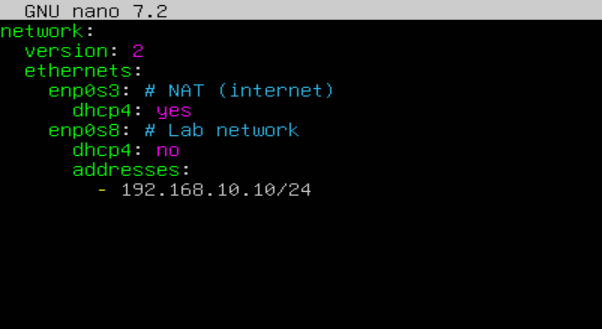
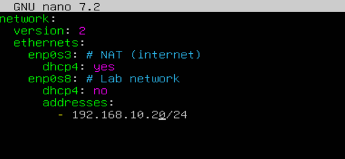
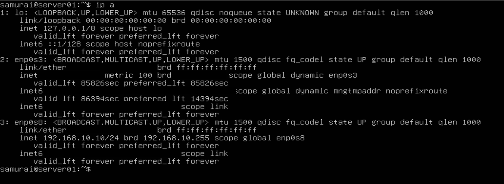
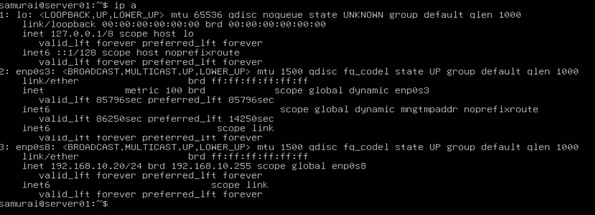
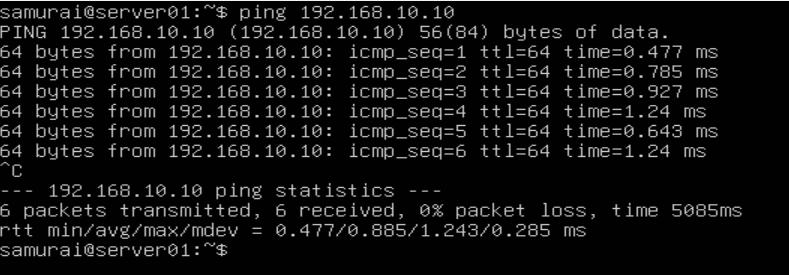
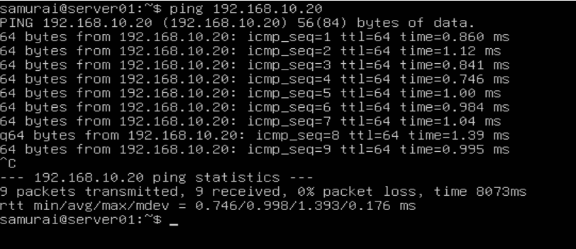
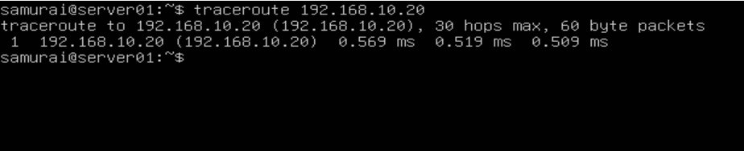
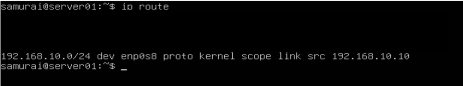
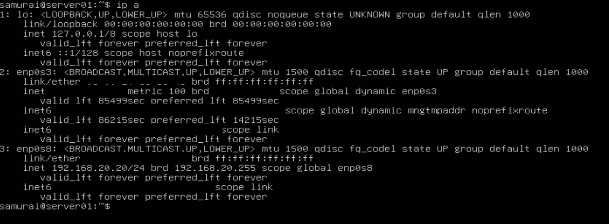
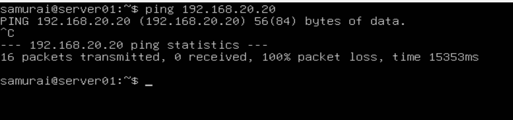

# 🧪 Basic Network Setup & Connectivity Lab

## 📌 Objective
Understand how IP addressing, subnetting, and basic connectivity work in a controlled virtual environment.

---

## ⚙️ Environment
- Virtualization: VirtualBox
- OS: Ubuntu Server (2 VMs)
- Network mode: Internal Network + NAT

VMs

| VM  | IP Address       | Role |
|-----|------------------|------|
| VM1 | 192.168.10.10/24 | Client |
| VM2 | 192.168.10.20/24 | Server |

---

## 🛠️ Setup

### Step 1 - Create Virtual Machines

Create two Linux virtual machines:
- server_01
- server_02

Recommended specs:
- 1 CPU
- 1-2 GB RAM
- 10+ GB disk

---

### Step 2 - Configure Network

Both VMs must use the same **Internal Network**
This ensures both machines are on the same isolated Layer 2 network.

---

### Step 3 - Assign Static IPs

server_01 configuration

Edit Netplan:

```bash
sudo nano /etc/netplan/01-netcfg.yaml

network:
  version: 2
  ethernets:
   enp0s3:
    dhcp4: yes
   enp0s8:
    dhcp4: no
    addresses:
     - 192.168.10.10/24

sudo netplan apply
```
server_02 configuration

```bash
sudo nano /etc/netplan/01-netcfg.yaml

network:
  version: 2
  ethernets:
   enp0s3:
    dhcp4: yes
   enp0s8:
    dhcp4: no
    addresses:
     - 192.168.10.20/24

sudo netplan apply
```




---

### Step 4 - Verify configuration

Check ip addresses:

```bash
ip a
```
Expectet output:
- server_01 -> 192.168.10.10
- server_02 -> 192.168.10.20




---

### Step 5 - Connectivity Test

From server_01:

```bash
ping 192.168.10.20
```

From server_02:

```bash
ping 192.168.10.10
```

Expected result:
- Successful ICMP replies
- Direct communication (same subnet)




---

### Step 6 - Traceroute Test

Install traceroute:

```bash
sudo apt install traceroute
```

Traceroute test:

```bash
traceroute 192.168.10.20
```

Expected result:
- Single hop (direct connection)
- No routes involved



---

### 🧪 Experiment - Break the Network (Subnet Mismatch)

Change server_02 IP

```bash
addresses: 
- 192.168.20.20/24

sudo netplan apply
```
---

## 🧠 Debugging

1. Confirm local network configuration

On server_01:

```bash
ip a
```

Expected result: 
- Correct IP assigned (192.168.10.10/24)
- Correct subnet mask (/24)


---

2. Verify routing table

```bash
ip route
```

Key observation:
- Only local subnet route exists
- No route to 192.168.20.0/24



---

3. Check target host reachability assumption

Verify server_02 configuration:

```bash
ip a
```


Key observation:
- Target IP is valid (192.168.20.20/24)
- server_02 belongs to a different subnet

---

4. Analyze packet decision process

When server_01 send traffic:

```bash
ping 192.168.20.20
```



Linux checks routing table:
- Is 192.168.20.20 in 192.168.10.0/24 ? -> ❌ No
- Use default gateway

---

5. Validate gateway capability

Check assumption:
- Default gateway is NAT (VirtualBox)
- It has no route to internal lab networks

Result:
❌ Gateway cannot reach 192.168.20.0/24

---

6. Confirm absence of router between the subnets

Check environment design:
- Only two VMs exist
- No routing device configured
- No IP forwarding enabled

Conclusion:
👉 No Layer 3 device connects both networks

---

🚨 Root Cause

The issue is:

❌ Subnet mismatch with no routing infrastructure

Specifically:
- server_01: 192.168.10.0/24
- server_02: 192.168.20.0/24
- No router exists between them

--- 

## 🔧 Resolution

Restore same subnet on server_02:

```bash
addresses:
 - 192.168.10.20/24

sudo netplan apply
```

---

## 🧪 Validation

from server_01:

```bash
ping 192.168.10.20
```


--- 

## 🧠 Key Takeaways

- Devices must be in the same subnet for direct communication
- Routing is required between different networks
- Linux always checks routing table before sending packets
- Default gateway is only used when no local route exists

--- 

## 🧭 Mental Model

When troubleshooting connectivity:
1. Is IP correct?
2. Is subnet correct?
3. Is destination in routing table?
4. Is a router required?
5. Does the router actually exists?


  
