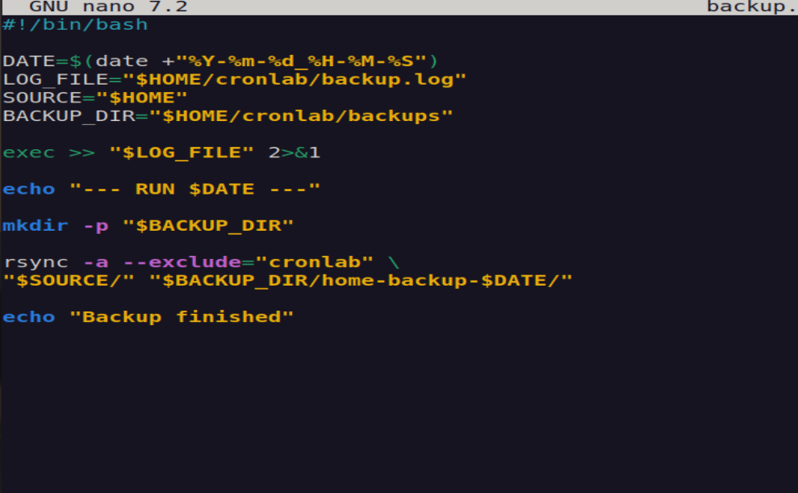
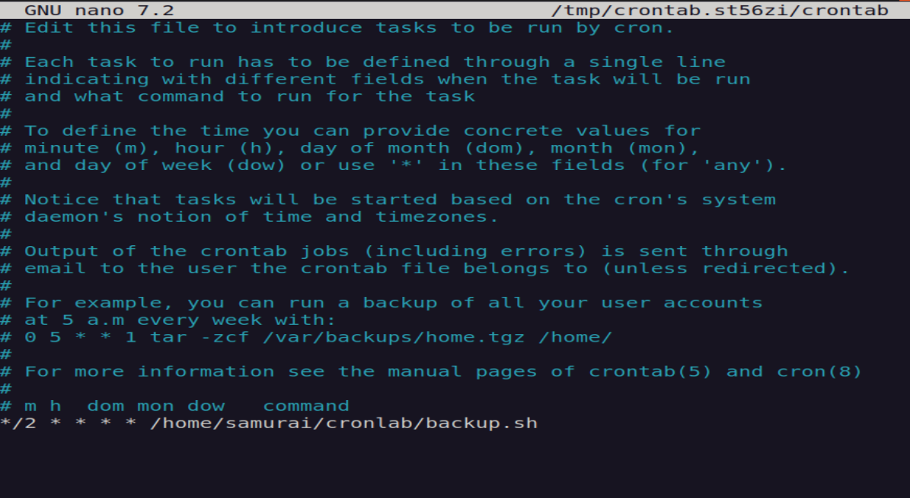
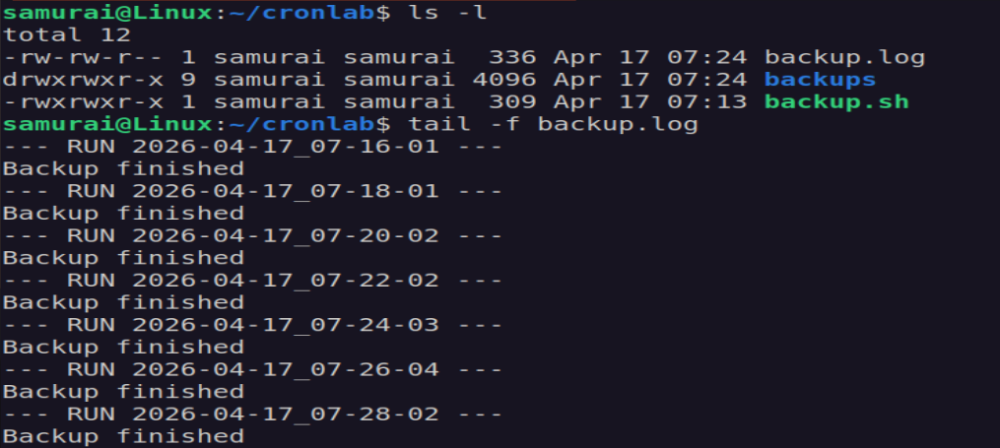
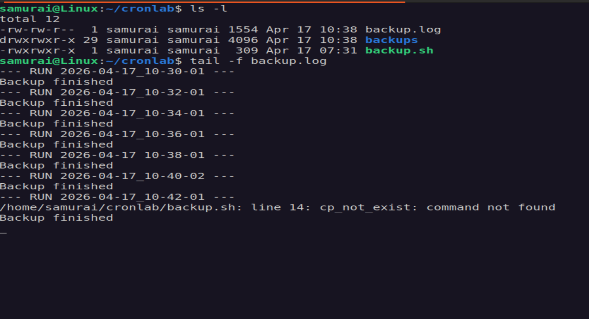
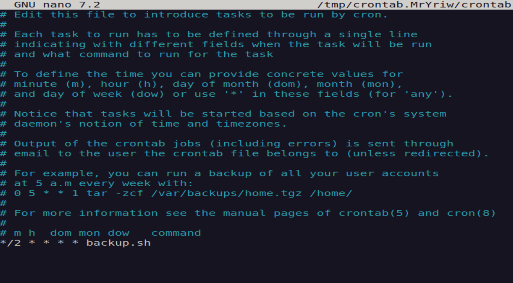

# 🧪 Cron Job Automation Lab

## 📌 Objective
To build a scheduled automation script, observe its behavior, and learn how to debug failures.

---

## ⚙️ Part 1 - Script Setup

Create a working directory:

```bash
mkdir -p ~/cronlab
cd ~/cronlab
```

Create the script:

```bash
nano backup.sh

#!/bin/bash

DATE=$(date +"%Y-%m-%d_%H-%M-%S")
LOG_FILE="$HOME/cronlab/backup.log"
SOURCE="$HOME"
BACKUP_DIR="$HOME/cronlab/backups"

exec >> "$LOG_FILE" 2>&1

echo "--- RUN $DATE ---"

mkdir -p "$BACKUP_DIR"

rsync -a --exclude="cronlab" \
"$SOURCE/" "$BACKUP_DIR/home-backup-$DATE/"

echo "Backup finished"
```


Make it executable:
```bash
chmod +x backup.sh
```
Test manually:

```bash
./backup.sh
```

Check log:
```bash
cat ~/cronlab/backup.log
```

---

## ⏰ Part 2 - Schedule with Cron

Open crontab:

```bash
crontab -e
```

Add job (every two minutes):

```bash
*/2 * * * * /home/samurai/cronlab/backup.sh
```



Verify cron service:

```bash
systemctl status cron
```

Monitor execution:

```bash
tail -f ~/cronlab/backup.log
```


---

## 💣 Part 3 — Failure Testing

### 🔴 Test 1 - Broken Command

Replace rsync with:

```bash
cp_not_exist /fake/source /fake/dest
```



---

### 🔴 Test 2 — Missing Full Path

Edit crontab:

```bash
*/2 * * * * backup.sh
```



👉 Script will not run.

Reason: cron has no working directory context.

---

### 🔴 Test 3 - Remove Execute Permission

```bash
chmod -x ~/cronlab/backup.sh
```

👉 Script does not run at all.

👉 No logs appear (script never starts).

---

### 🔴 Test 4 - Silent Failure

Remove logging line:

```bash
# exec >> "$LOG_FILE" 2>&1
```
👉 Cron runs, but no visible output.

---

## 📜 Part 4 - Logging Strategy

Key Concept
- stdout - normal output
- stderr - errors
- both redirected into one log file

---

## 🧠 Key Takeaways
- Always use absolute paths
- Failures can be silent
- Logging must be explicit
- Some errors occur before the script even starts


  
