# 🧪 DHCP Lab

## 📌 Objective
Understand how DHCP works in real network environment and how to debug common failure scenarios using a structured top-to-bottom approach.

---

## ⚙️ Environment
- Virtualization: VirtualBox
- OS: Ubuntu Server (1 DHCP Server VM & 2 Client VMs)
- Network mode: Internal Network + NAT (enp0s3 ignored for DHCP lab)

---

## 🛠️ Network Setup

### Interfaces

DHCP Server
- enp0s8 -> 192.168.10.10/24 (Lab network)
- enp0s3 -> NAT 

Clients
- enp0s8 -> DHCP assigned IPs
- enp0s3 -> NAT (not used)

---

### ⚙️ Network Configuration (Netplan)

Both server and clients are configured using Netplan, which defines interface behavior before DHCP starts.

🖥️ Client VM Netplan

```bash
sudo nano /etc/netplan/01-netcfg.yaml
```

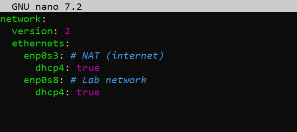

Meaning:
- enp0s3 -> NAT IP automatically assigned
- enp0s8 -> requests IP from DHCP server

---

🖥️ DHCP Server VM Netplan

```bash
sudo nano /etc/netplan/01-netcfg.yaml
```

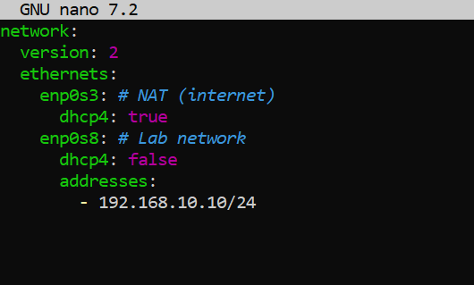

Meaning:
- enp0s8 is STATIC (required for DHCP sever stability)
- enp0s3 remains NAT
- DHCP server must always have fixed IP in lab network

---

### ⚙️ DHCP Server Configuration

```bash
sudo nano /etc/dhcp/dhcpd.conf
```

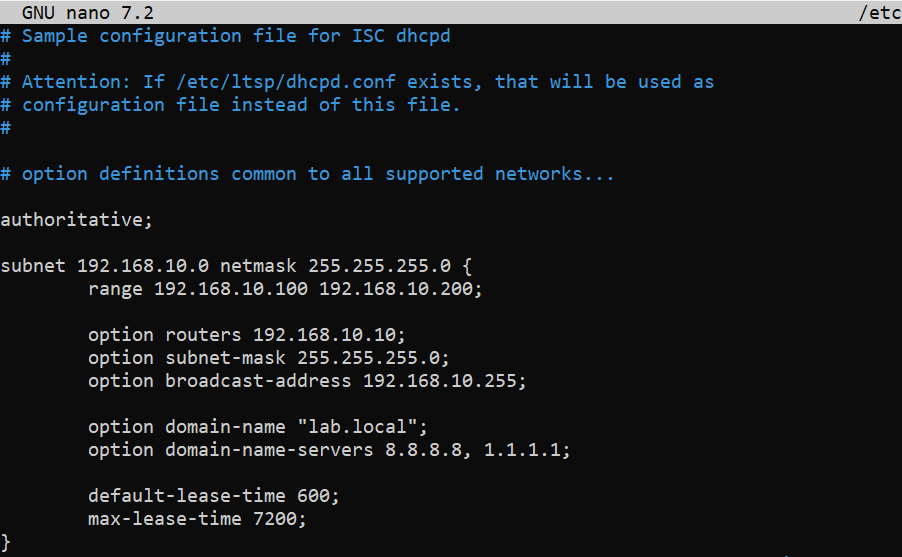

---

### ⚙️ DHCP Server Interface Binding

Before DHCP can operate, it must bind to the correct interface:

```bash
sudo nano /etc/default/isc-dhcp-server
```

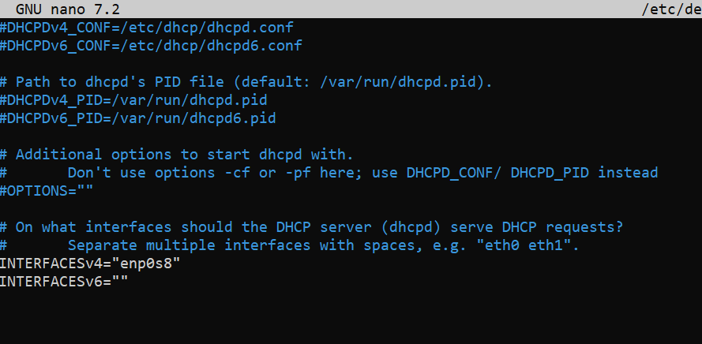

---

## ✅ Validation Flow

### Step 1 - Start DHCP Service

```bash
sudo systemctl start isc-dhcp-server
```

Check status:

```bash
sudo systemctl status isc-dhcp-server
```

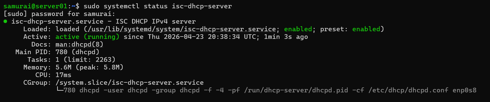

---

### Step 2 - Request IP

```bash
sudo dhclient -v enp0s8
```

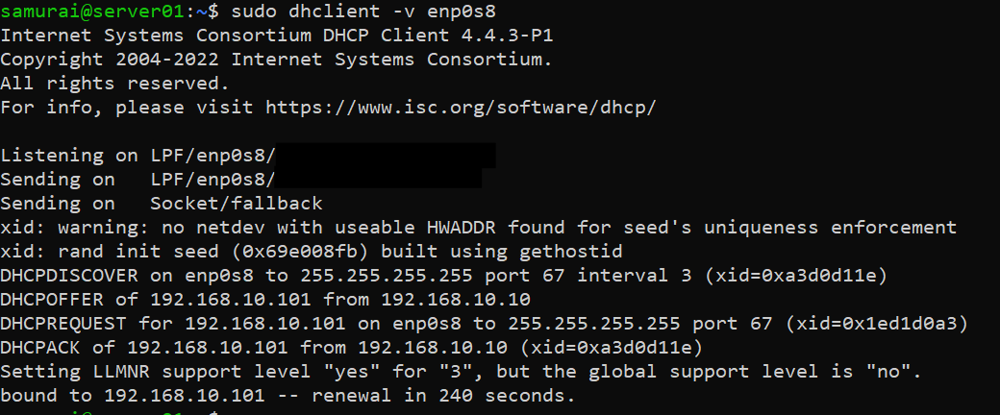

Verify IP assignment:

```bash
ip a show enp0s8
```

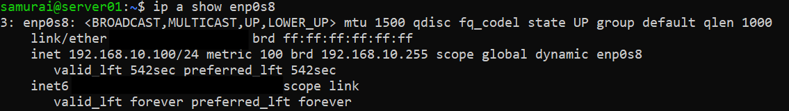

---

### Step 3 - Connectivity test

```bash
ping 192.168.10.100
```

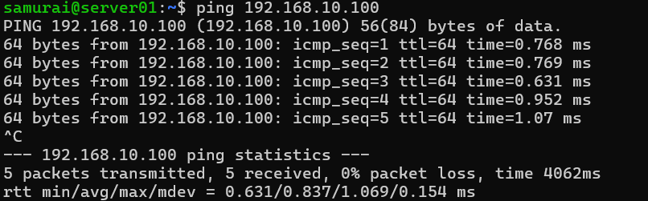

---

## 🧪 Challenge 1 - DHCP Service Fails to Start (Wrong Interface Binding)

Edit config to create a subnet mismatch:

```bash
sudo nano /etc/default/isc-dhcp-server

INTERFACEv4="enp0s3"
```

Expected outcome:
- DHCP service fails to start
- Client stuck in DHCPDISCOVER
- No IP assignment

---

## 🔥 Debugging

### Step 1 - Check service:

```bash
systemctl status isc-dhcp-server
```

!(DHCP_Failure)[dhcp_server_failure.png]

---

### Step 2 - Check logs:

```bash
sudo journalctl -u isc-dhcp-server
```

Error:
No subnet declaration for enp0s3 (10.0.2.15)

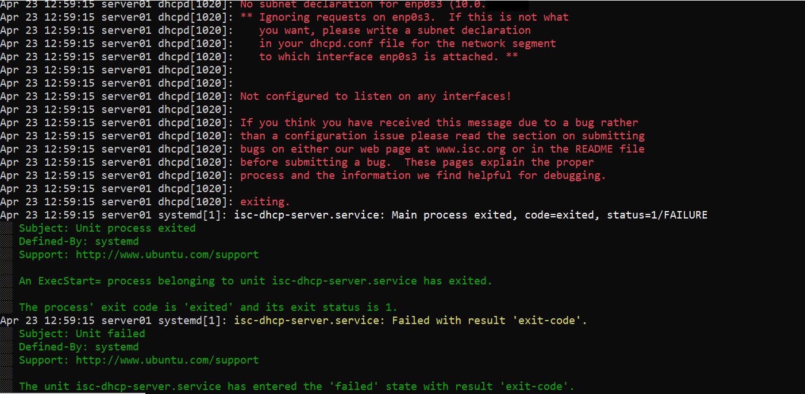

---

### 🧠 Root Cause

- DHCP is bound to enp0s3 (NAT)
- No matching subnet config exists for that interface
- Service cannot start

---

### ✅ Remediation

Bind DHCP to correct interface:

```bash
sudo nano /etc/default/isc-dhcp-server

INTERFACEv4="enp0s8"
```

Restart the DHCP service:

```bash
sudo systemctl restart isc-dhcp-server
```
  
---

## 🧪 Challenge 2 - Pool Exhaustion

Edit dhcpd.conf to reduce the pool to a single IP:

```bash
sudo nano /etc/dhcp/dhcpd.conf

subnet 192.168.10.0 netmask 255.255.255.0 {
  range 192.168.10.100 192.168.10.100;
}
```

Expected outcome:
- Client A -> gets IP
- Client B -> stuck in DHCPDICOVER

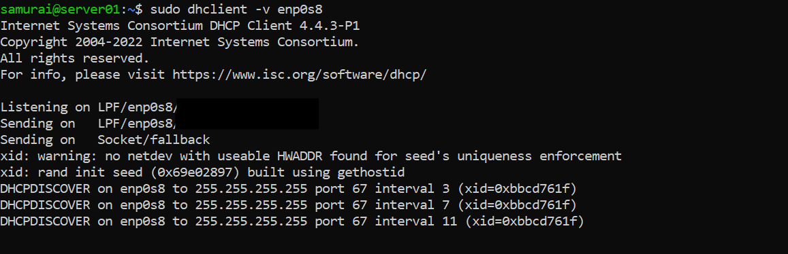

---

## 🔥 Debugging

### Step 1 - Check service

```bash
systemctl status isc-dhcp-server
```

**Interpretation**
- DHCP Service is running ✅
- DHCP is receiving requests ✅
- DHCP is refusing allocation ❗


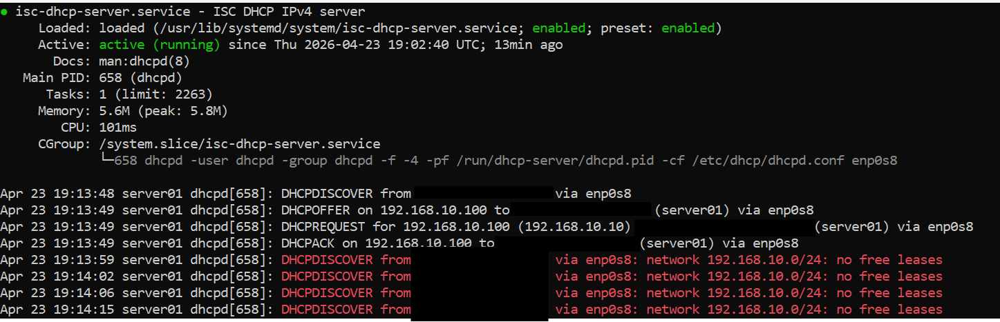

---

### Step 2 - Check logs

```bash
sudo journlctl -u isc-dhcp-server
```

**Result:**
- repeated no free leases


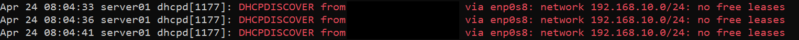

---

Step 3 - Check lease file

```bash
cat /var/lib/dhcp/dhcpd.leases
```

**Result:**
- pool fully assigned
- single active lease


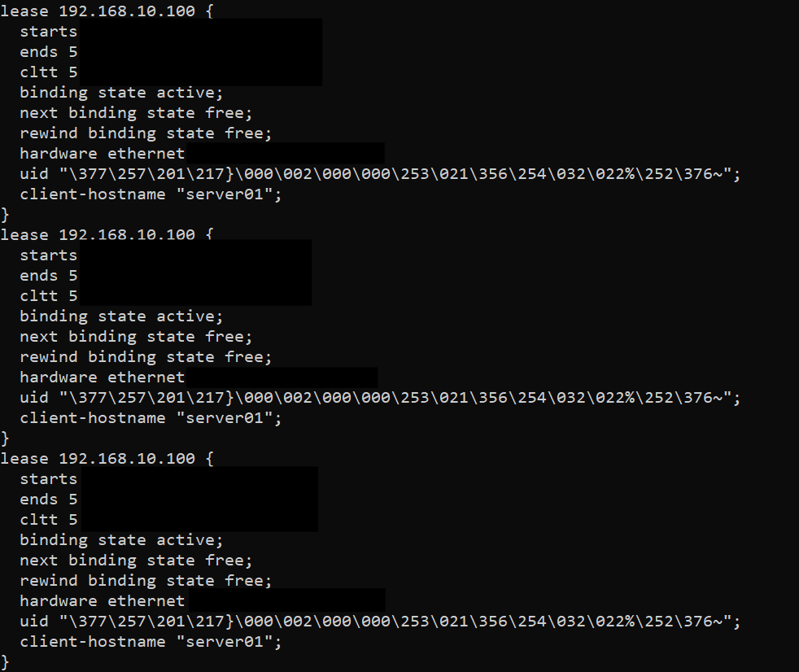

---

### 🧠 Root Cause

- Pool size = 1
- Lease already assigned
- No available IPs

DHCP is functioning correctly, but the IP pool is exhausted.

---

### ✅ Remediation

Expand pool:

```bash
sudo nano /etc/dhcp/dhcpd.conf

range 192.168.10.100 192.168.10.200;
```

Restart the service:

```bash
sudo systemctl restart isc-dhcp-server
```

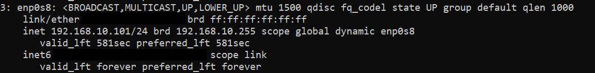

---

### 🧠 Key lessons

- Interface binding is critical
- DHCP must match subnet to interface
- Logs reveal root cause quickly

---

## 🔥 Debugging hierarchy

1. Check service
2. Check logs
3. Check traffic
4. Check leases
5. Validate client