## Objective

The lab focuses on troubleshooting real-world network failures by systematically isolating issues at each layer of the network stack.

---

## Network Topology

```
LAN (User Network)		DMZ (Service Network)
192.168.10.0/24			192.168.20.0/24
__________________		_____________________

Client VM			Server VM
192.168.10.101			192.168.20.10
	|				|
	|				|
	________ Firewall VM ___________
		(Router + Firewall)
```

---

## Issue 1: No connectivity between networks

Failure to connect to the webserver

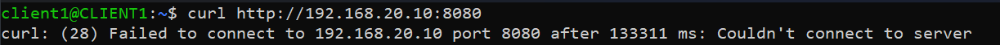

---

## Troubleshooting Workflow

### Step 1 - Verify the service exists

From Server:

```bash
ss -tuln | grep :8080
```

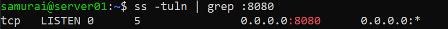

QUESTION: Is the application listening?
NO -> Problem in application layer
YES -> Continue

### Step 2 - Verify local connectivity

From Firewall:

```bash
curl http://192.168.20.10:8080
```

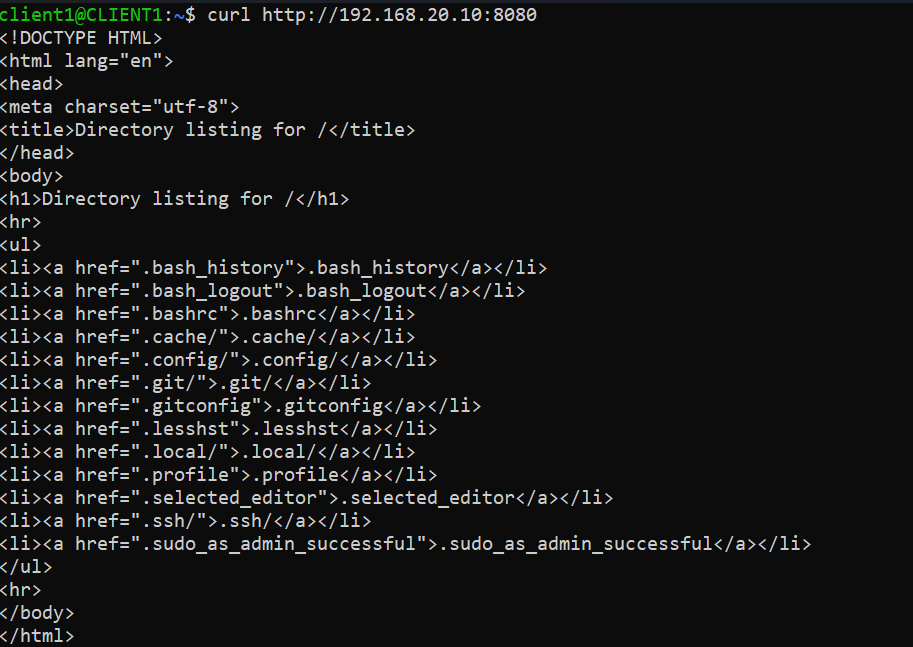

QUESTION: Can the firewall reach the server?
NO -> Routing/Interface problem
YES -> Server & DMZ network are working. (Continue)

### Step 3 - Verify packet arrival 

On firewall: 

```bash
sudo tcpdump -i enp0s8 tcp port 8080
```

On client:

```bash
curl http://192.168.20.20:8080
```

!(enp0s8)[enp0s8.png]

QUESTION: Does traffic reach the firewall?
NO -> Client routing issue, Wrong gateway, Wrong subnet
YES -> Client-Firewall network works correctly (Continue)

### Step 4 - Verify packet forwarding

On firewall: 

```bash
sudo tcpdump -i enp0s9 tcp port 8080
```

On client:

```bash
curl http://192.168.20.20:8080
```

!(enp0s9)[enp0s9.png]

QUESTION: Does the traffic leave the firewall?
NO -> Problem exists INSIDE firewall forwarding path: ip_forward is disabled, nftables is dropping packets, routing table issue (Continue)
YES -> Problem is likely: return path, server firewall, application

### Step 5 - Verify kernel forwarding

```bash
sysctl net.ipv4.ip_forward
```
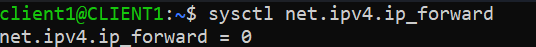

ROOT CAUSE FOUND

```bash
sudo sysctl -w net.ipv4.ip_forward=1
```
OR

```bash
sudo nano /etc/sysctl.d/99-sysctl.conf
net.ipv4.ip_forward=1
sudo sysctl --system
```

### Step 6 - Verify

From client:

```bash
curl http://192.168.20.10:8080
```
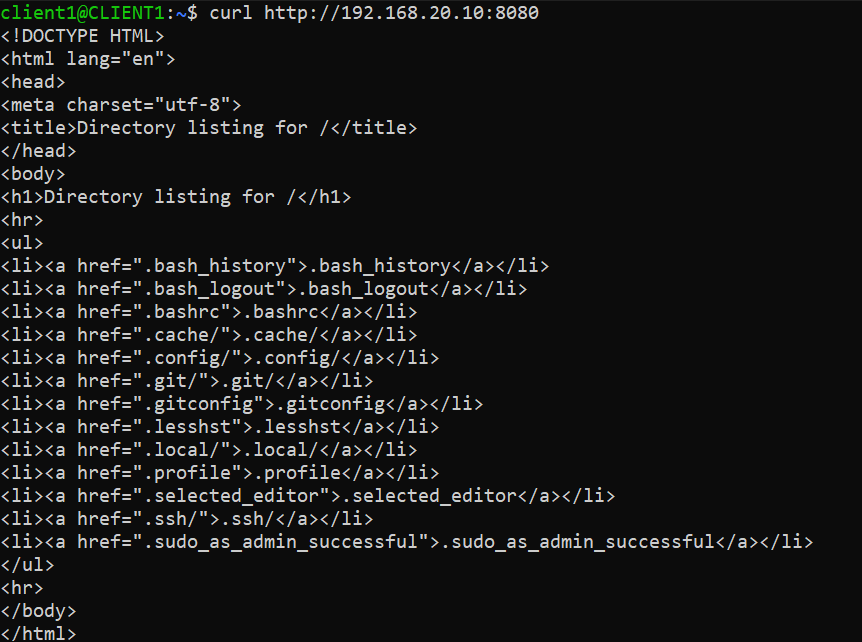

---

## Issue 2: Server reachable from firewall but not client

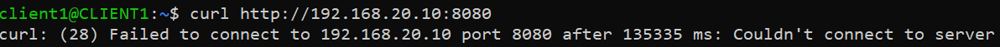

---

## Troubleshooting Workflow

### Step 1 - Verify the service exists

From Server:

```bash
ss -tuln | grep :8080
```

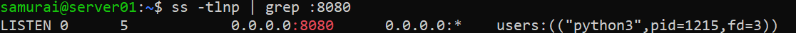

QUESTION: Is the application listening?
NO -> Problem in application layer
YES -> Continue

### Step 2 - Verify local connectivity

From firewall:

```bash
curl http://192.168.20.10:8080
```


QUESTION: Can the firewall reach the server?
NO -> Routing/Interface problem
YES -> Server & DMZ network are working. (Continue)

### Step 3 - Verify packet arrival

On firewall:

```bash
sudo tcpdump -i enp0s8 tcp port 8080
```

On client:

```bash
curl http://192.168.20.10:8080
```
.png)

QUESTION: Does traffic reach the firewall?
NO -> Client routing issue, Wrong gateway, Wrong subnet
YES -> Client-Firewall network works correctly (Continue)

### Step 4 - Verify packet forwarding

On firewall: 

```bash
sudo tcpdump -i enp0s9 tcp port 8080
```

On client:

```bash
curl http://192.168.20.20:8080
```
.png)

QUESTION: Does the traffic leave the firewall?
NO -> Problem exists INSIDE firewall forwarding path: ip_forward is disabled, nftables is dropping packets, routing table issue (Continue)
YES -> Problem is likely: return path, server firewall, application

### Step 5 - Verify kernel forwarding

```bash
sysctl net.ipv4.ip_forward
```
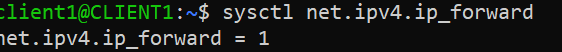

### Step 6 - Check nftables behavior

```bash
sudo nft list ruleset
```
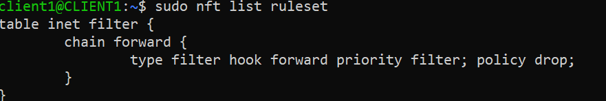

ROOT CAUSE: The firewall is dropping all forwarded traffic because no FORWARD chain rules exist to explicitly allow LAN → DMZ communication.

---

FIX:

```bash
sudo nft add rule inet filter forward ct state established,related accept
sudo nft add rule inet filter forward iif enp0s8 oif enp0s9
sudo nft add rule inet filter forward ip saddr 192.168.10.101 ip daddr 192.168.20.10 tcp port 8080 accept
```
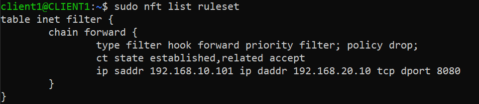

### Step 7 - Verify 

From client:

```bash
curl http://192.168.20.10:8080
```

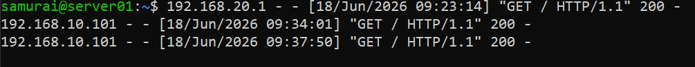

