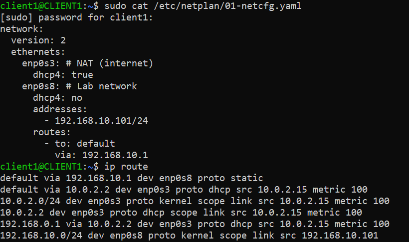
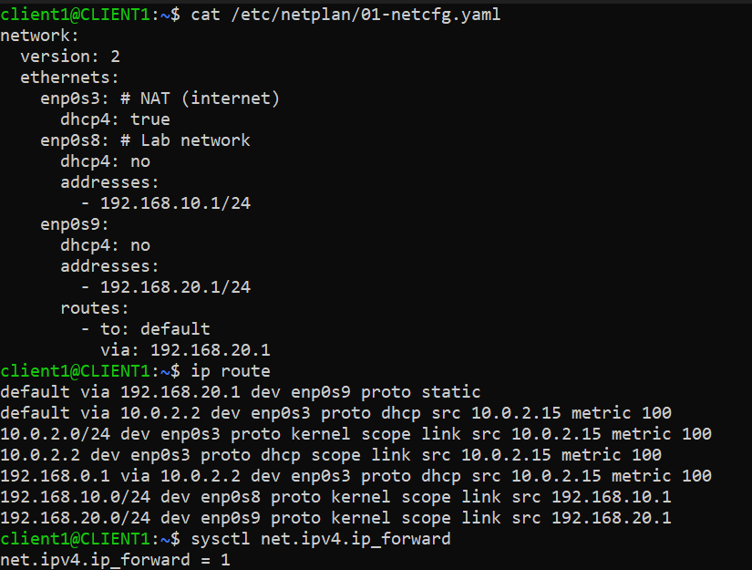
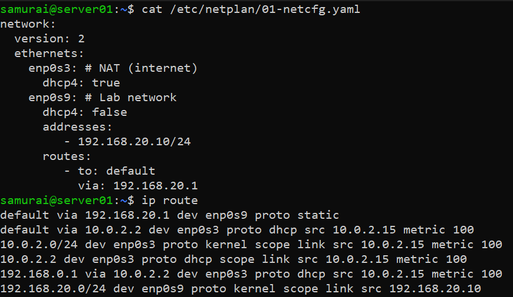
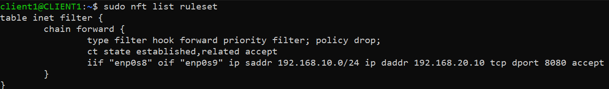
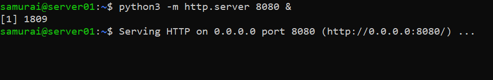
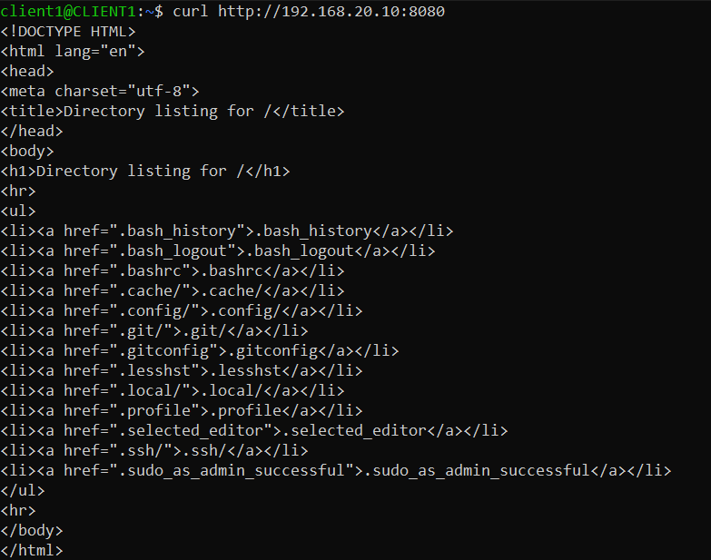
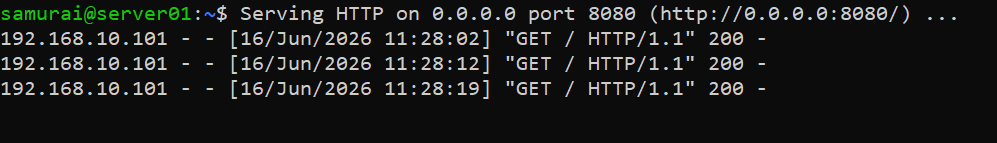
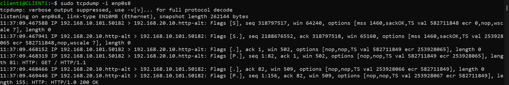
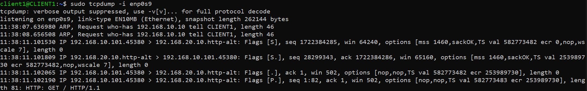

## Objective

The goal of this lab is to design and implement a basic DMZ (Demilitarized Zone) network using Linux virtual machines, understand routing between network segments, and apply nftables as a stateful firewall.

---

## Network Topology

```
LAN (User Network)		DMZ (Service Network)
192.168.10.0/24			192.168.20.0/24
__________________		_____________________

Client VM			Server VM
192.168.10.101			192.168.20.10
	|				|
	|				|
	________ Firewall VM ___________
		(Router + Firewall)
```

---

## VM & Routing Configuration

### Client VM



```bash
sudo netplan try
sudo netplan apply
```

### Firewall VM (Core Router)



```bash
sudo netplan try
sudo netplan apply
```

The Firewall MUST ENABLE packet forwarding:

Temporary enable:

```bash
sudo sysctl -w net.ipv4.ip_forward=1
```

Permanent enable:

```bash
echo "net.ipv4.ip_forward=1" | sudo tee /etc/sysctl.d/99-ipforward.conf
sudo sysctl --system
```

### Server VM (DMZ Host)



```bash
sudo netplan try
sudo netplan apply
```

---

## nftables Firewall Configuration

### Step 1 - Create table

```bash
sudo nft add table inet filter
```

### Step 2 - Create FORWARD chain (core DMZ control point)

```bash
sudo nft add chain inet filter forward \
'{ type filter hook forward priority 0; policy drop; }'
```

### Step 3 - Allow return traffic (stateful firewall behavior)

```bash
sudo nft add rule inet filter forward \
ct state established,related accept
iif enp0s8 oif enp0s9
```

### Step 4 - Allow LAN -> DMZ HTTP access (TCP 8080)

```bash
sudo nft add rule inet filter forward \
ip saddr 192.168.10.101 \
ip daddr 192.168.20.10 \
tcp dport 8080 accept
```


---

## Services Used

On Server VM:

```bash
python3 -m http.server 8080 &
```
This simulates a simple HTTP service.



---

## Testing

### LAN to DMZ connectivity (HTTP)

From Client VM:

```bash
curl http://192.168.20.10:8080
```



From Server VM:



### Firewall verification

Check packet flow:

```bash 
sudo tcpdump -i enp0s8
sudo tcpdump -i enp0s9
```




Expected:
- Requests visible on enp0s8
- Forwarded traffic visible on enp0s9

