# 🧪 DNS Lab

## 📌 Objective
Understand DNS from a systems perpective

---

## ⚙️ Environment
- Virtualization: VirtualBox
- OS: ( 1 DNS Server VM + 1 Client VM)

---

## 🛠️ Lab Network Topology

### 🧩 Phase 1 — Direct DNS (No Cache)

Client VM -> dnsmasq (192.168.10.10)

Used for:
- Break #1 (Wrong DNS Server)
- Break #2 (Wrong DNS Record)

---

### 🧩 Phase 2 — Direct DNS (No Cache)

Clint VM -> systemd-resolved (127.0.0.53) [CACHE] -> dnsmasq (192.168.10.10) [DNS SERVER]

Used for:
- Break #3 (DNS Caching Behavior)

---

## ⚙️ Part 1 — DNS Server Setup (dnsmasq)

### Step 1 - Install 

```bash
sudo apt install dnsmasq
```
---

### Step 2 - Configure domain mapping

```bash
sudo nano /etc/dnsmasq.conf
```
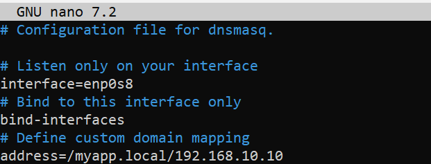

---

### Step 3 - Start service

```bash
sudo systemctl restart dnsmasq
sudo systemctl status dnsmasq
```

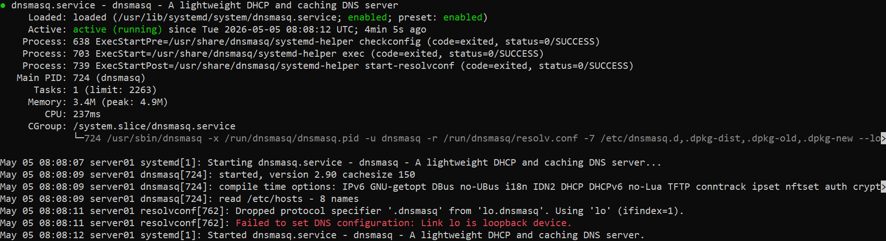

---

### Step 4 - Test locally

```bash
dig @127.0.0.1 myapp.local
```

Expected result:
myapp.local -> 192.168.10.10

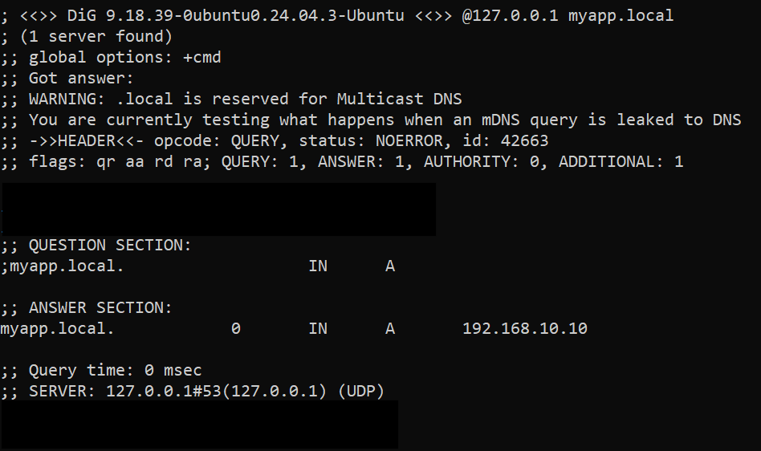

---

## ⚙️ Part 2 — Client Setup (Phase 1: No cache)

**Client sends queries directly to dnsmasq.**

Client -> dnsmasq

---

### Step 1 - Configure resolver manually

```bash
sudo nano /etc/resolv.conf
```
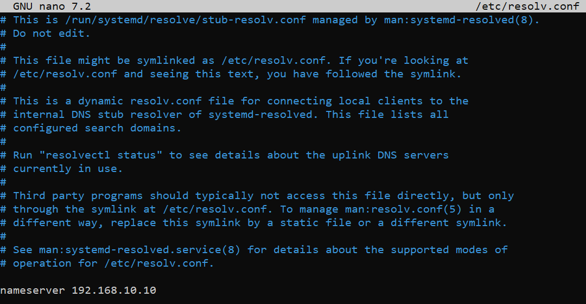

---

### Step 2 - Test

```bash
dig myapp.local
ping myapp.local
```
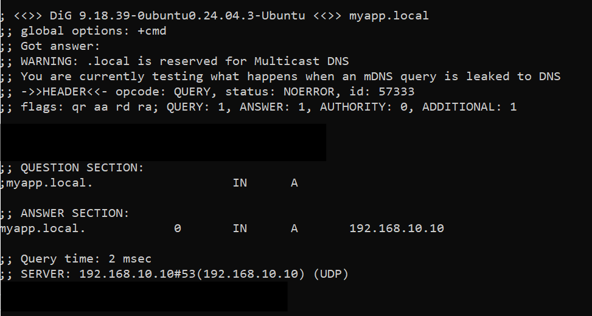

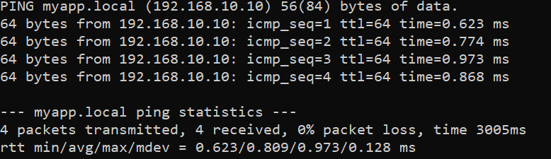

---

## Break 1 - Wrong DNS Server

**Change resolver**

```bash
sudo nano /etc/resolv.conf
```

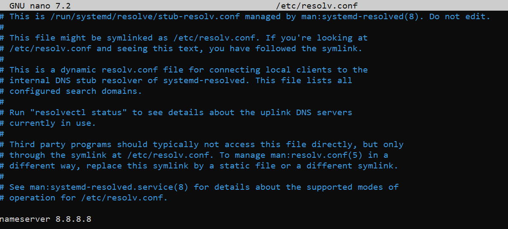

---

## Observed behavior

- dig myapp.local -> communications error to 8.8.8.8#53, timed out
- ping -> temporary failure in name resolution
- ping 192.168.10.10 

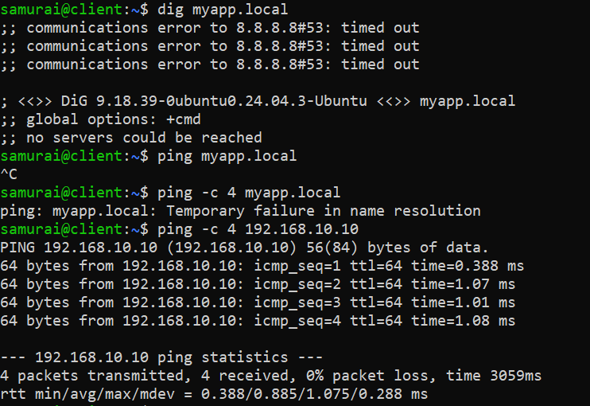

---

## Interpetation

DNS query sent to wrong server

---

## 🧠 Root Cause

Client resolver misconfigured

---

## 🔧 Fix

Change the resolver config:

```bash
nameserver 192.168.10.10
```

---

## Break 2 - Wrong DNS Record

Misconfigure dnsmasq.conf

```bash
sudo nano /etc/dnsmasq.conf
sudo systemctl restart dnsmasq
```
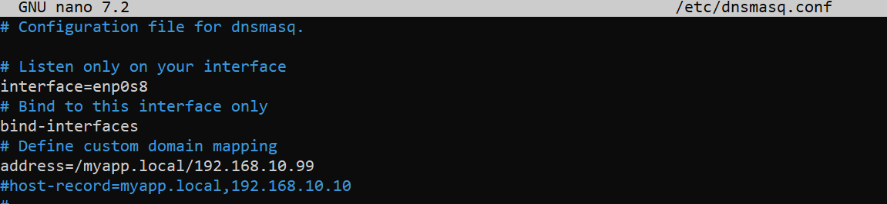

---

## Observed behavior

Run from client VM:
- dig myapp.local -> 192.168.10.99
- ping myapp.local -> fails (Destination Host Unreachable)
- ping 192.168.10.10 -> works 

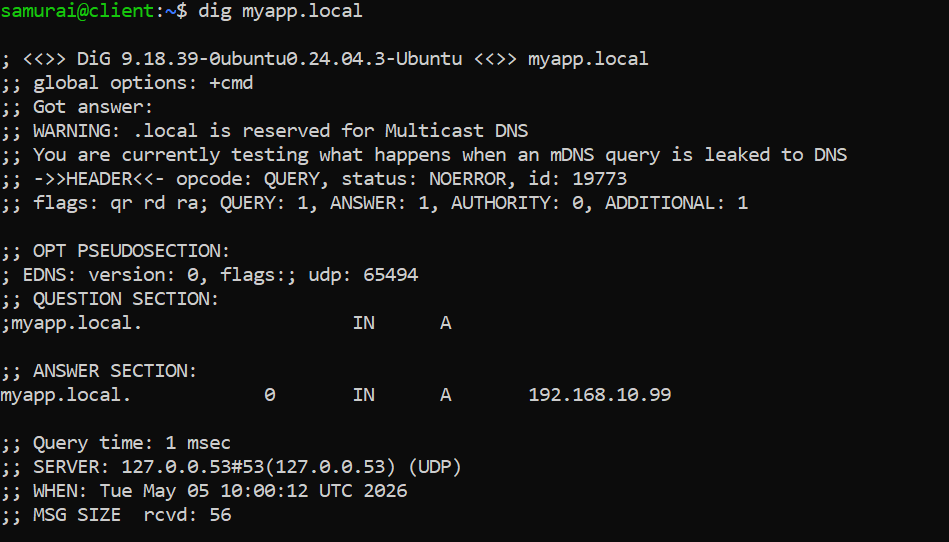

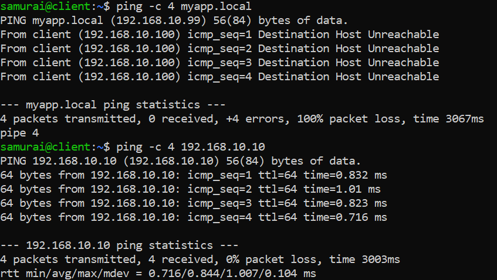

---

## Interpretation

DNS works but returns incorrect IP

---

## 🧠 Root Cause

**Conclusion:** dnsmasq is misconfigured

---

## 🔧 Fix

Change the dnsmasq.conf:

```bash
address=/myapp.local/192.168.10.10
```

---

## Break 3 - Cached DNS

### ⚙️ Setup 

Step 1: Enable caching on client vm: 

```bash
sudo systemctl enable --now systemd-resolved
sudo ln -sf /run/system/resolve/stub-resolv.conf /etc/resolv.conf
sudo resolvectl dns enp0s8 192.168.10.10
```

# Step 2: Configure server dnsmasq.conf:

```bash
address=/myapp.local/192.168.10.99
local-ttl=60
cache-size=1000

sudo systemctl restart dnsmasq
```

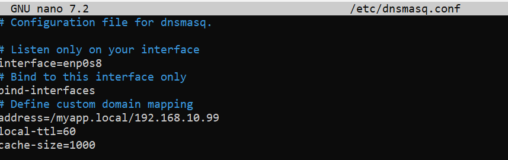

---

## Observed behavior

On client VM:

```bash
sudo resolvectl query myapp.local
```

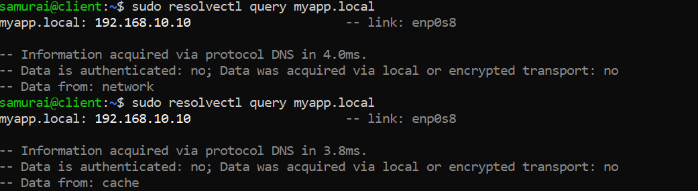

---

## Interpretation

Client cache used instead of querying DNS

---

## 🧠 Root Cause

TTL not expired -> cached response

---

## 🔧 Fix

```bash
sudo resolvectl flush-caches
```


