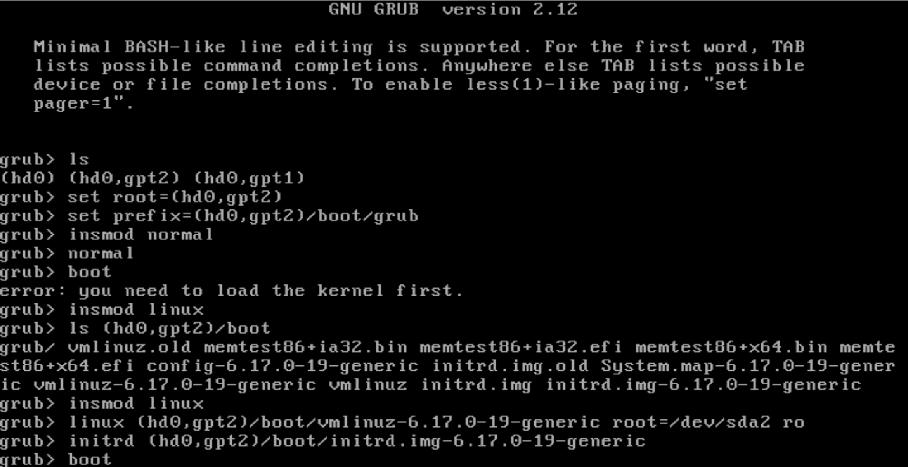
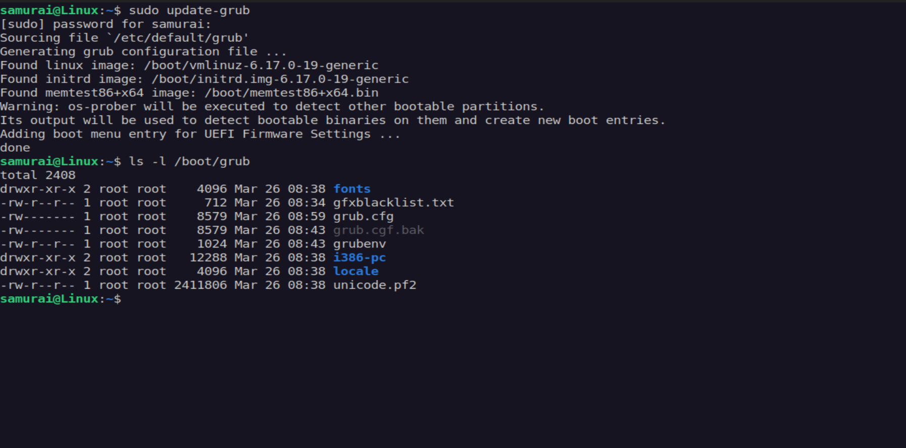

## 🚨 The Alert

**Time:** 2:04 AM  
**Alert:** PagerDuty - server 'web-prod-03' unreachable  

**SLA:** Server must be back online within 60 minutes  

After attaching to the console, it was immediately clear the machine had dropped into the GRUB2 shell — it never made it to the OS.

---

## 🖥️ Environment

| Detail | Value |
|--------|--------|
| Server | web-prod-03 |
| Root Partition | /dev/sda2 |
| Kernel Location | /boot |
| Target SLA | < 60 min |

---

## 🔍 What Went Wrong

The GRUB2 configuration file `/boot/grub/grub.cfg` was missing or corrupted, so the bootloader had no instructions on where to find the kernel.

**Lab Note:** To simulate this failure:
```bash
mv /boot/grub/grub.cfg /boot/grub/grub.cfg.bak
```

---

## ⏱️ Incident Timeline

| Time | Action |
|------|--------|
| 02:04 | PagerDuty alert received |
| 02:07 | Attached to console |
| 02:11 | Root partition identified |
| 02:18 | Server back online |
| 02:35 | GRUB config regenerated |

---

## 🛠️ Step-by-Step Recovery

### Step 1 — List Available Devices
```bash
ls
```
**Output:** (hd0) (hd0,gpt1) (hd0,gpt2)

---

### Step 2 — Find the Root Filesystem
```bash
ls (hd0,gpt2)/boot/
```
**Output:** vmlinuz + initrd  

Root filesystem identified: (hd0,gpt2)

---

### Step 3 — Load Normal Mode
```bash
set root=(hd0,gpt2)
set prefix=(hd0,gpt2)/boot/grub
insmod normal
normal
```

If the boot menu appears, select your kernel and boot normally.

---

### Step 4 — Manual Boot (If Needed)
```bash
insmod linux
linux (hd0,gpt2)/boot/vmlinuz-6.17.0-19-generic root=/dev/sda2 ro
initrd (hd0,gpt2)/boot/initrd.img-6.17.0-19-generic
boot
```


---

### Step 5 — Make Fix Permanent

On Debian/Ubuntu:
```bash
sudo update-grub
```


On RHEL/CentOS:
```bash
sudo grub2-mkconfig -o /boot/grub2/grub.cfg
```

Verify:
```bash
ls -lh /boot/grub/grub.cfg
```

---

## ✅ Resolution

Server restored at **02:18** (14 minutes after alert).  
Permanent fix completed at **02:35**, within SLA.

---

## 📚 Lessons Learned

- Always verify `/boot/grub/grub.cfg` after kernel updates  
- GRUB shell recovery is a critical skill  
- Document partition layout (`lsblk`) before incidents  
