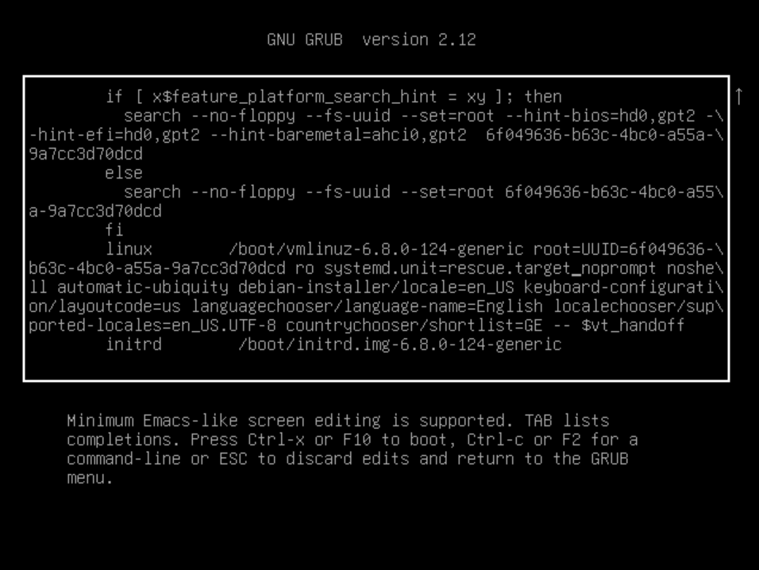
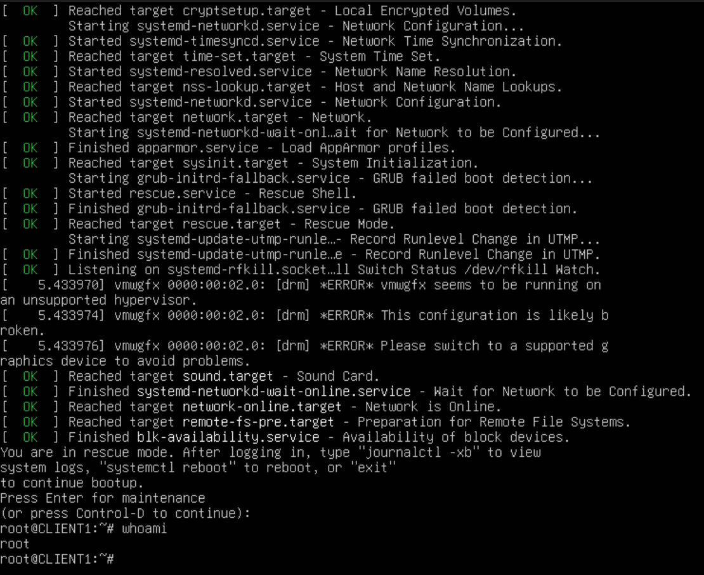
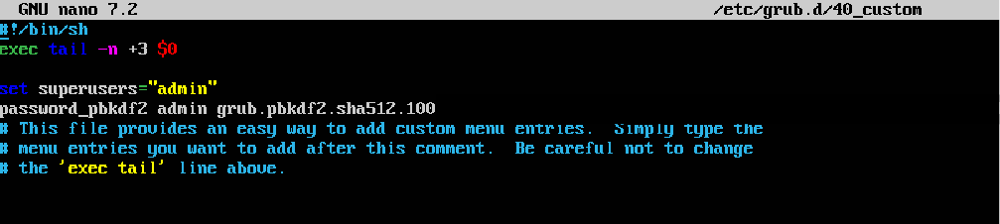

## Attack Simulation: Gaining Root Access via GRUB

### Objective

Demonstrate how physical access to a Linux system can be abused to gain root privileges by modifying GRUB boot parameters.

---

## Prerequisites
- OS: Linux Ubuntu
- Access to GRUB menu during boot
- No GRUB password protection enabled

---

## Attack Steps

1. Reboot the system and access the GRUB menu.
2. Select the default Linux entry and press e to edit boot parameters.
3. Locate the line starting with: linux /boot/vmlinuz-...
4. Modify the line
5. Boot the modified entry using Ctrl + X



## Result

- The system boots into rescue mode or a root shell
- Authentication is bypassed
- Attacker obtains root-level access before login



---

## Defense: GRUB Hardening Using Password Protection

### Objective

Prevent unauthorized modification of boot parameters by securing GRUB with a password.

---

### Step 1: Generate a GRUB Password Hash

```bash
sudo apt update
sudo apt install grub-common
grub-mkpasswd-pbkdf2
```

### Step 2 - Configure GRUB User Authentication

```bash
sudo nano /etc/grub.d/40-custom
```


### Step 3 - Apply Configuration

```nano
sudo update-grub
```

### Step 4 - Reboot and Test

```bash
sudo reboot
```
Pressing SHIFT to enter GRUB menu

---

## Result after Hardening


- Boot parameter editing is blocked without authentication
- Kernel-level attack methods are prevented

---

## Conclusion

GRUB password protection is an essential security layer that prevents:

- Boot parameter manipulation
- Unauthorized rescue mode access
- Root shell injection via kernel arguments

However, it should be combined with:

- Full disk encryption (LUKS)
- BIOS/UEFI security
- Secure boot configuration

to fully protect against physical attacks.


