# 🧪 Linux Permission and Access Control Lab

## 📌 Objective
To test how Linux file permissions and access control mechanisms work in a multi-user environment.

---

## ⚙️ Environment 

- OS: Ubuntu
- Tools: chmod, chown, ls, groups, sudo
- Users: alice, bob, admin
- Groups: devs, managers

---

## 🛠️ Setup

### 1. Create Users

```bash
sudo adduser alice
sudo adduser bob
sudo adduser admin
```

---

### 2. Create Groups

```bash
sudo groupadd devs
sudo groupadd managers
```

Assign users:

```bash
sudo usermod -aG devs alice
sudo usermod -aG managers bob
sudo usermod -aG devs admin
sudo usermod -aG managers admin
```

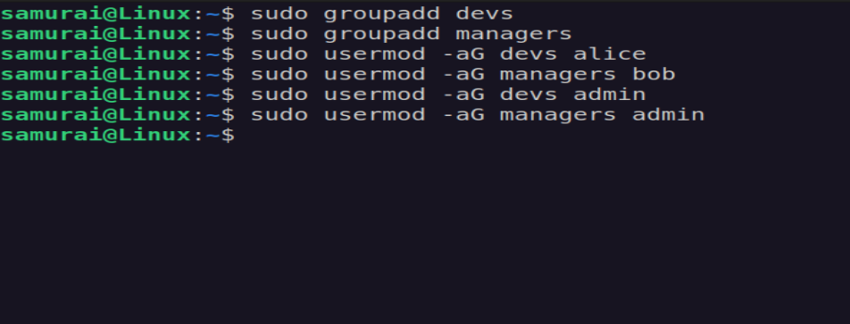

---

### 3. Create Shared Directory

```bash
sudo mkdir -p /project/data
sudo chown admin:devs /project/data
sudo chmod 2770 /project/data
```

P.S (setgid - 2) ensures all new files inherit the devs group

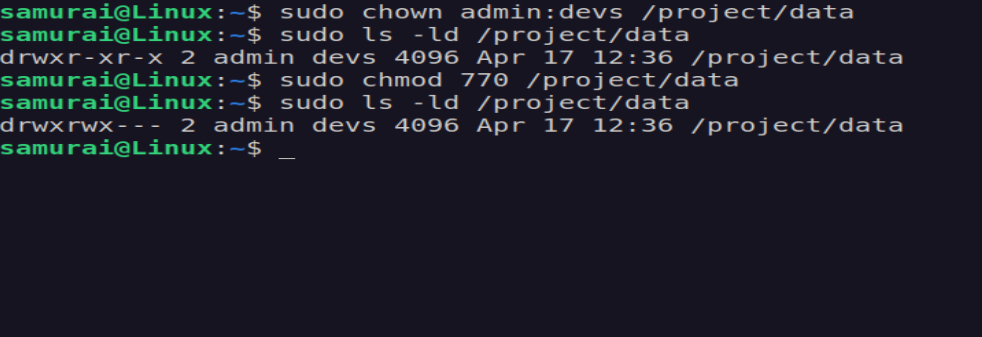
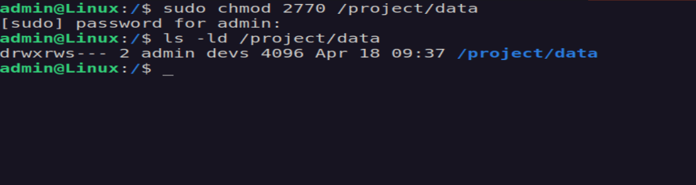

---

### 4. File Creation as admin

```bash
sudo -u admin
echo "Sensitive data" > /project/data/report.txt 
```

Set permissions and ownership:
```bash
sudo chmod 640 /project/data/report.txt
```

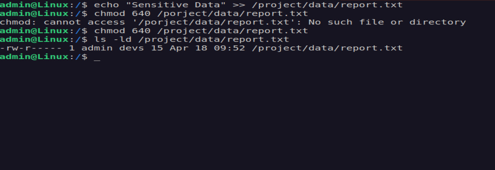

---

### 🚨 Scenario: Permission Denied

Problem:

User bob cannot access /project/data/report.txt

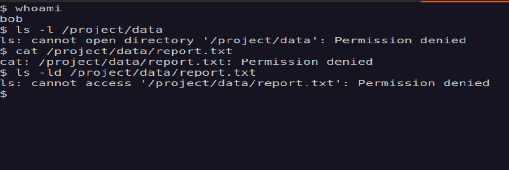

---

### 🔍 Debugging Steps 

1. Check file permissions

```bash
ls -ld /project/data/report.txt
```

2. Check directory permissions

```bash
ls -ld /project/data 
```

3. Check user group membership

```bash
groups bob
```

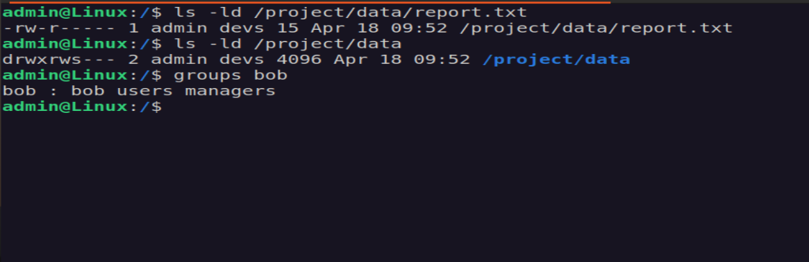

---

## 🛠 - Fix (Least Privilege)

Add bob to devs

```bash
sudo usermod -aG devs bob
```

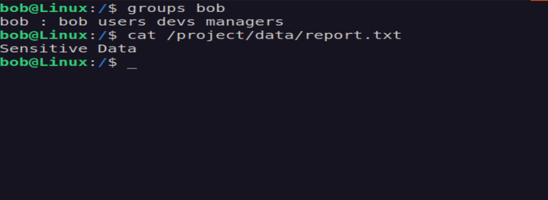

---

### Sticky Bit (+t)

```bash
chmod +t /project/data
```

- Prevents users from deleting files they do not own

---

### SetGID (g+s)

```bash
chmod g+s /project/data
```

- Ensures consistent group ownership for new files

---

## 🧪 Challenge 1

Configure /project/data so:
- only admin can delete files
- developers can modify files

```bash
ls -ld /project/data
ls -ld /project/data/alice.txt
```

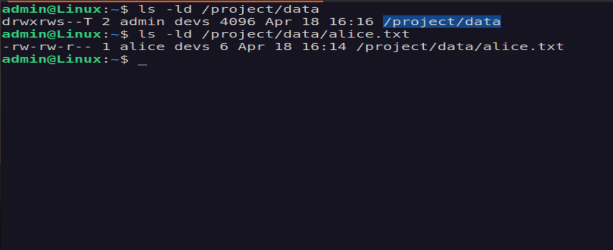

As the directory was already configured to satisfy the requirements — ownership set to admin:devs with permissions rwxrws--T (SetGID + sticky bit).
When Alice (a devs member) created a file inside the directory, it was correctly assigned ownership alice:devs with permissions rw-rw-r--, confirming that SetGID inheritance was working as expected.
However, when Bob (also a devs member) attempted to edit the file's content, he received Permission Denied despite having group write access.

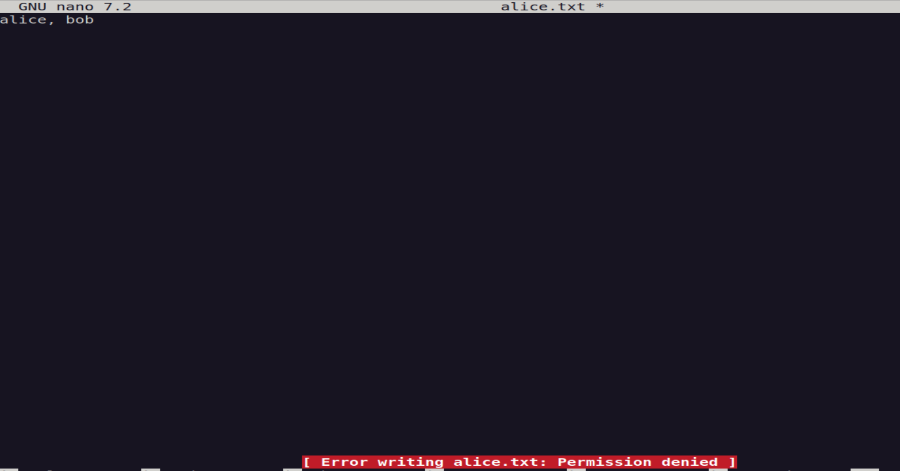

Root Cause
After investigation, the issue was traced to a kernel-level security feature introduced in newer Linux versions. Ubuntu 24.04.3 ships with the following sysctl setting enabled by default:
fs.protected_regular = 2

This setting restricts write access to files located in sticky bit directories — even for users who have the appropriate group write permissions. When set to 2, the kernel blocks any process from writing to a file it does not own inside a sticky+SetGID directory, regardless of what the Unix permission bits or ACLs say.

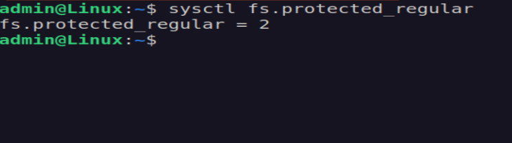

---

## 🧪 Challenge 2

Create a file where:
- alice can read
- bob cannot 
- group has no access

```bash
touch file.txt
chmod 400 file.txt
```

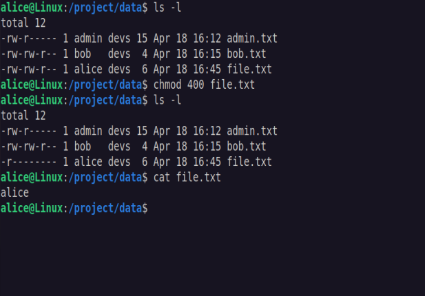

---

## 🧪 Challenge 3 

Let's break access intentionally: 

```bash
chmod 600 /project/data/admin.txt
```

and let's debug why access fails for other users.


I checked the file with ls -l /project/data/report.txt and saw it is owned by admin with group developers.
Alice is a member of the devs group, but the file permissions are set to 600, which means the group has no permissions.
Therefore, even though alice is in the correct group, she cannot read the file because group access is disabled.


---

## 🧠 Key Takeaways

File vs Directory Permissions
- File permissions control content access (read/write)
- Directory permissions control file operations (create/delete/access)

---

Group Membership ≠ Access
- Being in the correct group does not guarantee access
- Access depends on actual permission vits (rwx)

---

Deletion Depends on Directory, Not File
- A user can delete a file if they have write + execute on the directory
- Sticky bit (+t) restricts deletion to file owner, directory owner, root

---

SetGID Enables Collaboration
- Ensures all new files inherit the directory's group
- Prvents inconsistent group owenrship in shared environments

---

Umask Affects Default Security
- Controls default permissions for new files
- Misconfigured umask can silently break collaboration


