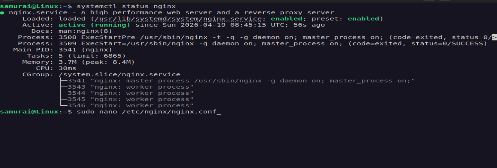
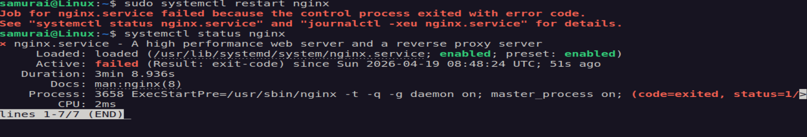
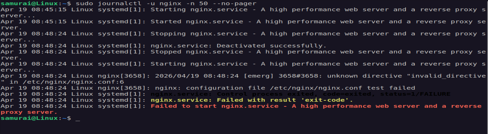
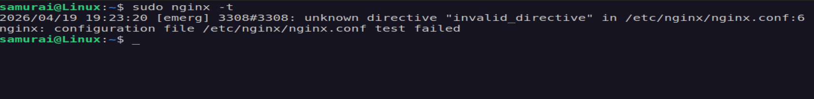
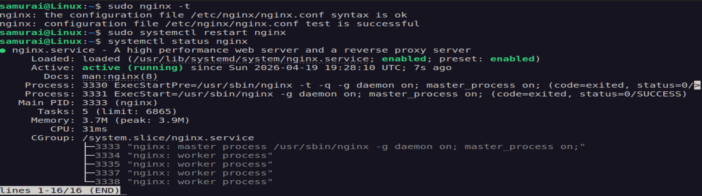
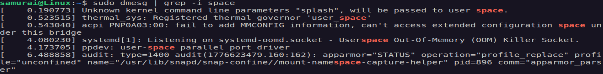
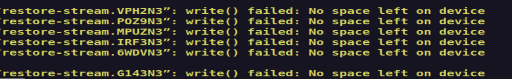
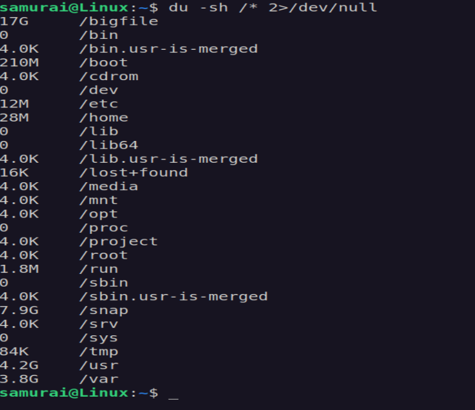
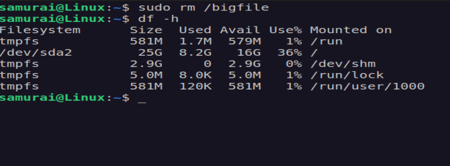
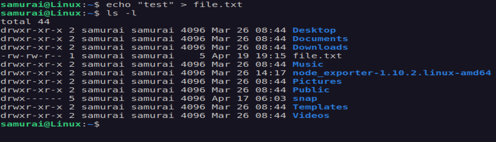

# 🧪 Log Analysis & System Debugging Lab

## 📌 Objective
- Read system logs like real incidents
- Identify root causes
- Debug common system failures

---

## ⚙️ Environment 

- OS: Ubuntu
- Tools: journalctl, df, du, dmesg

---

## 🚨 Scenario 1: Service Crash Investigation

### Step 1 - Break the service

```bash
sudo nano /etc/nginx/nginx.conf
```
Add invalid line:

```bash
invalid_directive;
```

Restart:

```bash
sudo systemctl restart nginx
```

### Step 2 - Investigate

Check status:

```bash
systemctl status nginx
```





Check logs:

```bash
sudo journalctl -u nginx -n 50 --no-pager
```



Switch to application-level debugging:

```bash
sudo nginx -t
```



### Step 3 - Fix conf

Remove bad line "invalid_directive"

### Step 4 - Verify

```bash
sudo nginx -t
sudo systemctl restart nginx
```


---

## 🚨 Scenario 2: Disk Full Incident

### Step 1 - Fill disk

```bash
sudo fallocate -l 16G /bigfile
```

### Step 2 - Trigger failiure

```bash
echo "hello" > file.txt
```

🔍 Expected Result: 
No space left on device

### Step 3 - Investigate

```bash
df -h
```


Check system messages:

```bash
dmesg | grep -i space
```


Check logs (may be unreliable):

```bash
sudo systemctl -xe
```



Find what filled the disk:

```bash
du -sh /* 2>/dev/null
```



### Step 4 - Fix the issue:

```bash
sudo rm /bigfile
df -h
```


### Step 5 - Verify recovery:

```bash
echo "test" > file.txt
```



---

## 🧠 Key Takeaways

- Disk issues often look like unrelated failures
- Logs may fail or be incomplete
- Always check disk first
- Must verify fixes, not assume


