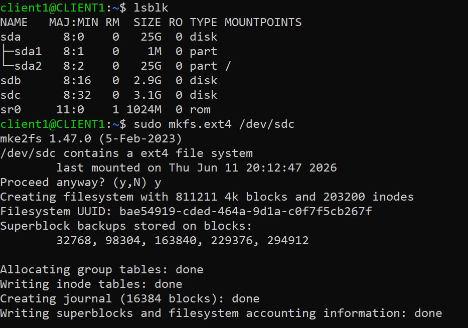
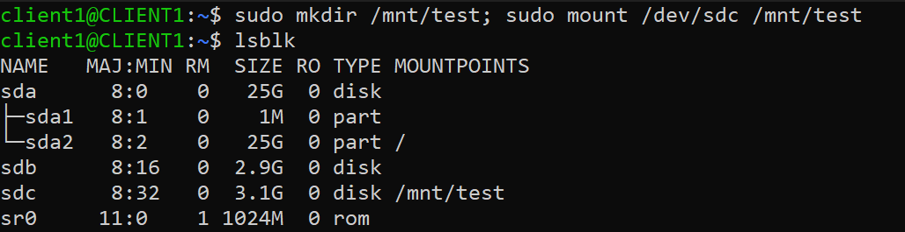
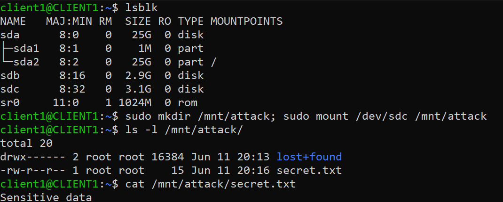
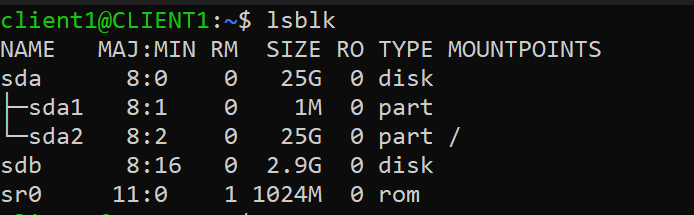
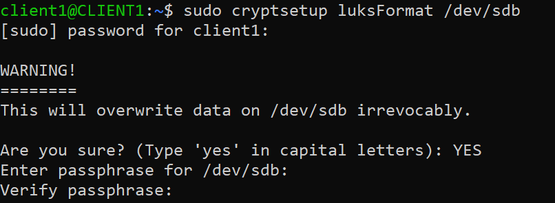
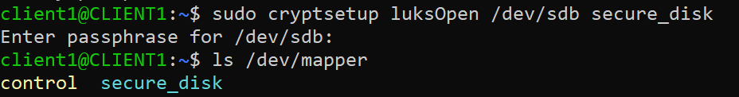
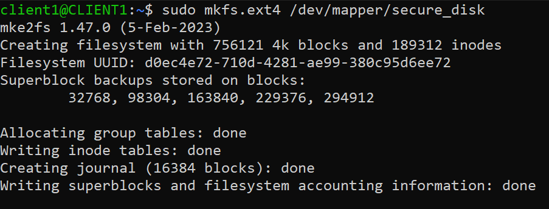
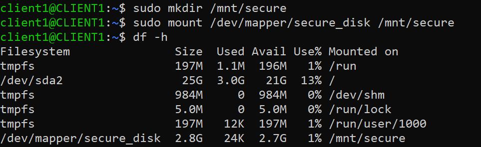
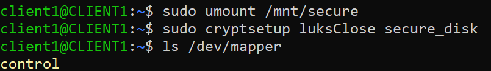
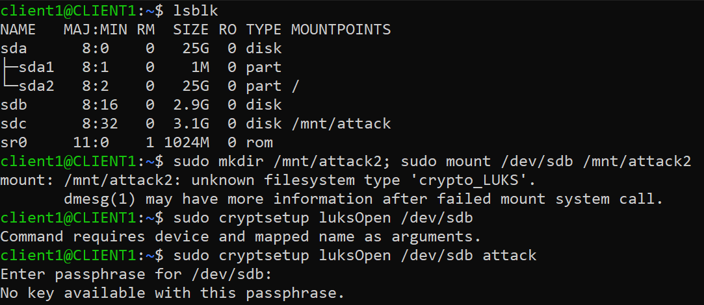

### Objective

This lab demonstrates how Linux Full Disk Encryption (LUKS) works and what it protects against.

---

## Part 1 - Attack Scenario (Unencrypted Disk)

### Step 1 - Identify disk

```bash
lsblk
```

### Step 2 - Create filesystem (no ecnryption)

```bash
sudo mkfs.ext4 /dev/sdc
```



### Step 3 - Mount disk

```bash
sudo mkdir /mnt/test
sudo mount /dev/sdc /mnt/test
```



### Step 4 - Add sensitive data

```bash
echo "Sensitive data" | sudo tee /mount/test/secret.txt
```

---

## ATTACK SIMULATION

### Step 1 - Direct mount attempt

```bash
sudo mkdir /mnt/attack; sudo mount /dev/sdc /mnt/attack
ls -l /mnt/attack
cat /mnt/attack/secret.txt
```



---

## Part 2 - LUKS Encryption Setup (Defense)

### Step 1 - Identify target disk

```bash
lsblk
```
Find: target -> sdb (2.9G)

 


### Step 2 - Initialize LUKS encryption

```bash
sudo cryptsetup luksFormat /dev/sdb
```




### Step 3 - Unlock encrypted disk

```bash
sudo cryptsetup luksOpen /dev/sdb secure_disk
ls /dev/mapper
```



This creates: /dev/mapper/secure_disk

### Step 4 - Create filesystem

```bash
sudo mkfs.ext4 /dev/mapper/secure_disk
```



### Step 5 - Mount filesystem

```bash
sudo mkdir /mnt/secure
sudo mount /dev/mapper/secure_disk /mnt/secure
``` 



### Step 6 - Store secret data

```bash
echo "TOP SECRET DATA" | sudo tee /mnt/secure/secure/secret.txt
```

### Step 7 - Unmount filesystem and close encrypted disk

```bash
sudo umount /mnt/secure
sudo cryptsetup luksClose secure_disk
```



---

## Part 3 - Attack against LUKS Disk

Attacker steals /dev/sdb

### Step 1 - Try direct mount

```bash
sudo mkdir /mnt/attack2; sudo mount /dev/sdb /mnt/attack2
```

### Step 2 - Try unlocking encrypted disk

```bash
sudo cryptsetup luksOpen /dev/sdb
```



---

## Part 4 - Legitimate Unlock Process

### Step 1 - Unlock disk

```bash
sudo cryptsetup luksOpen /dev/sdb secure_disk
```
Enter passphrase.


### Step 2 - Mount 

```bash
sudo mount /dev/mapper/secure_disk /mnt/secure
```

### Step 3 - Read data 

```bash
cat /mnt/secure/secret.txt 
```
---

## Key Security Insight

LUKS protects:
- Data at rest
- Stolen disks
- Offline attacks

LUKS does NOT protect:
- Already-unlocked system
- Root user after login
- Weak passphrases
- RAM extraction attacks
