# 🧪 Linux Networking and Service Exposure Lab

## 📌 Objective
This lab simulates real-world Linux networking issues and teaches how to troubleshoot:

- Service availability
- Port listening
- Firewall behavior (UFW)
- Binding ('localhost' vs external access)
- Network-layer debugging

---

## ⚙️ Environment 

- OS: Ubuntu (VM + Bridged Adapter)
- Service: Nginx
- Tools: ss, curl, ufw, systemctl
- Host machine for external testing (Powershell)

---

## 🟢 Stage 1 

Verify service:

```bash
systemctl status nginx
```

Expected outcome:
Active (running)

Check listening ports:

```bash
ss - tuln | grep :80
```

Expected outcome:
0.0.0.0:80

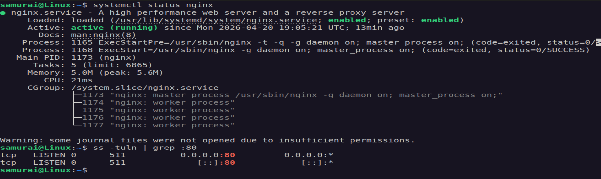

Test locally:

```bash
curl 192.160.0.199
```

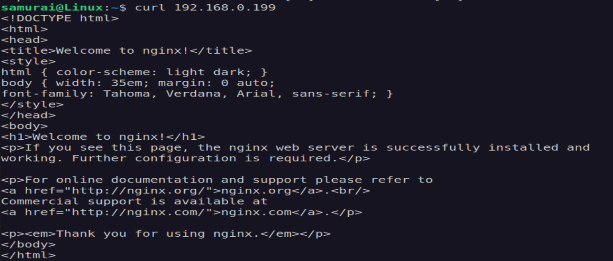

Test from host:

```powershell
Test-NetConnection 192.168.0.199 -Port 80
```

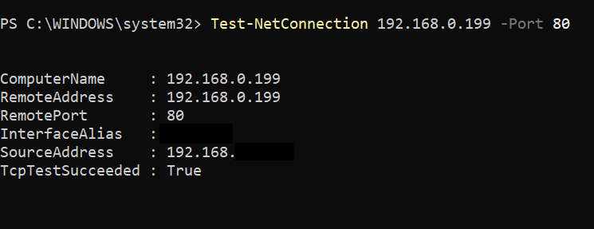


---

## 🔴 Stage 2 - Break the System

### 🧪 Challenge 1 - Firewall Block

```bash
sudo ufw enable
sudo ufw deny 80
```

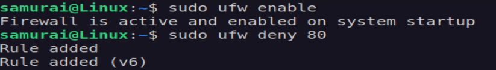

Expected Outcome:
- Local curl works

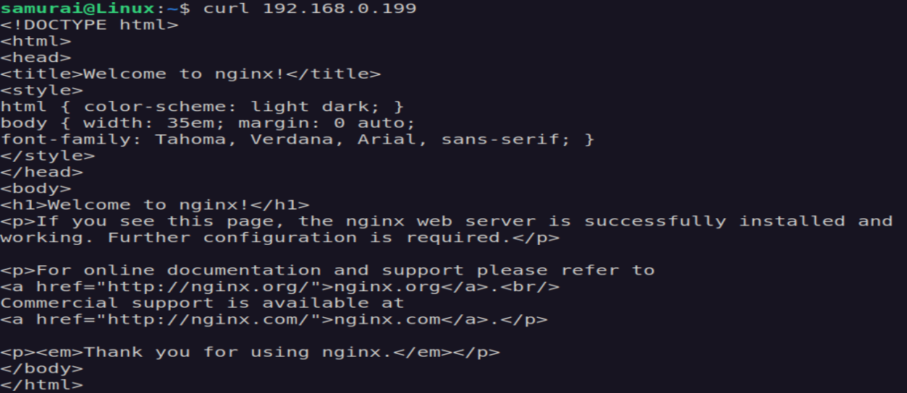

- External connection fails 

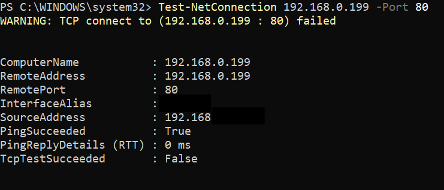

### 🔥 Debugging

1. Confirm service is running:

```bash
systemctl status nginx
```

2. Confirm port is listening:

```bash
ss -tuln | grep :80
```
Expected Outcome:

0.0.0.0:80

3. Test local access:

```bash
curl http://localhost
```

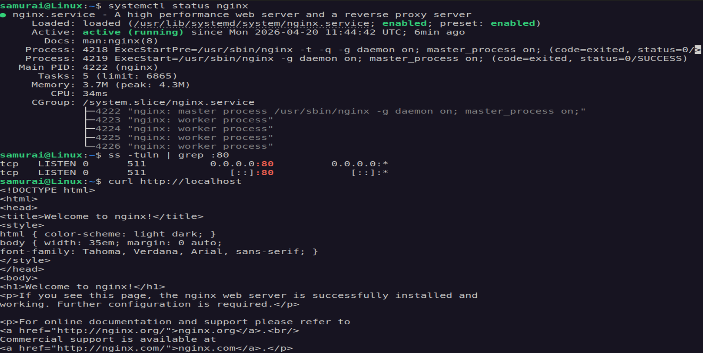

4. Check firewall state:

```bash
sudo ufw status verbose
```

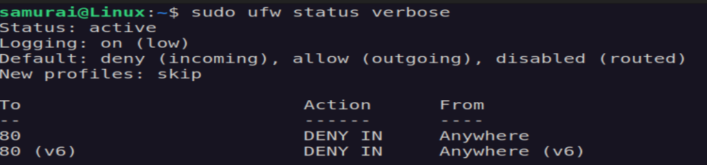

### 🧠 Diagnosis

Service run locally but not externally -> firewall is blocking TCP traffic

### 🛠 Fix

```bash
sudo ufw allow 80/tcp
```
or

```bash
sudo ufw disable
```


### ✅ Verification

From host:


### 🧠 Key lesson

1. PING working does not mean service is reachable
2. Firewall blocks TCP, not ICMP in many cases

---

### 🧪 Challenge 2 - Bind to localhost only

Edit conf:

```bash
sudo nano /etc/nginx/sites-available/default
```

Change:

```bash
listen 127.0.0.1:80;
listen [::1]:80;
```
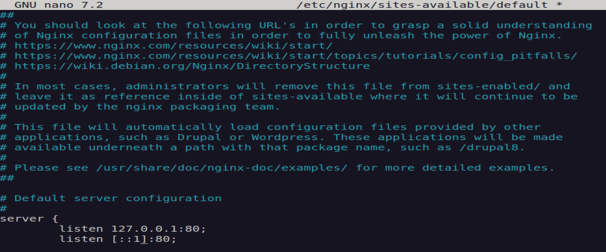

Restart:

```bash
sudo systemctl restart nginx
```

Expected outcome:
- curl localhost works ✔
- curl IP fails ❌

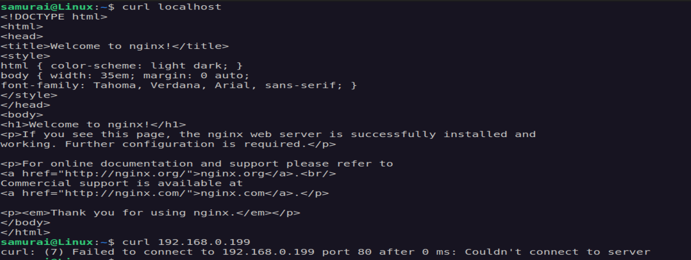

- Host access fails ❌


### 🔥 Debugging

1. Check service:

```bash
systemctl status nginx
```
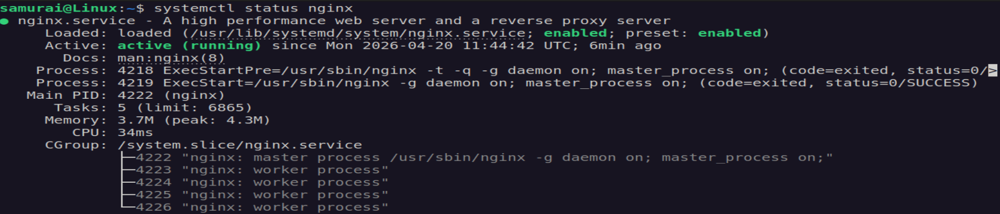

2. Check listening interface:

```bash
ss -tuln | grep :80
```
Expected Outcome:
 
127.0.0.1:80

3. Test localhost explicitly:

```bash
curl http://localhost
```

4. Test network IP address:

```bash
curl 192.168.0.199
```
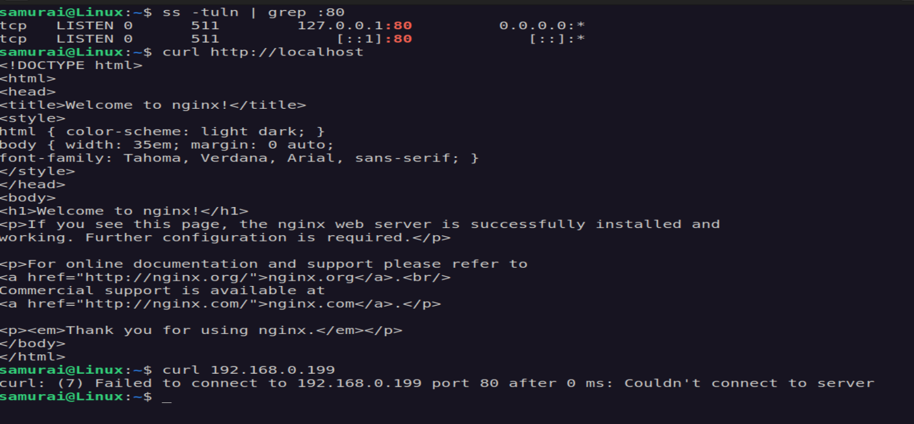

5. Confirm config source:

```bash
nginx -T | grep listen
```

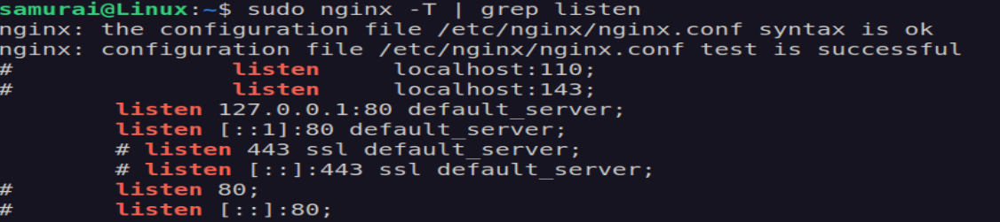

### 🧠 Diagnosis

Service is restricted to loopback interface -> not exposed to network

### 🛠 Fix

Edit config:

```bash
sudo nano /etc/nginx/sites-available/default
```
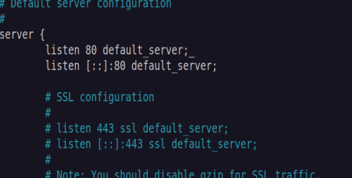

Restart:

```bash
sudo systemctl restart nginx
```

### ✅ Verification

```bash
ss -tuln | grep :80
curl http://192.168.0.199
```
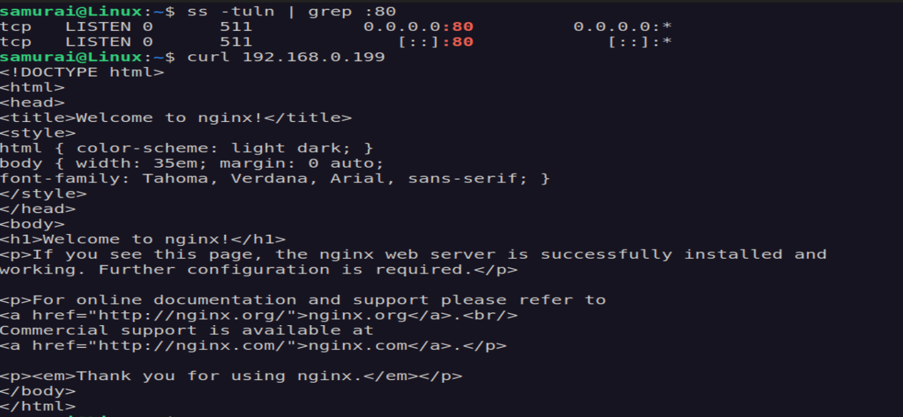

### 🧠 Key lesson

Binding defines WHO can connect, not whether service runs


---

### 🧪 Challenge 3 - Wrong Port 

Edit config:

```bash
listen 8080;
listen [::]:8080;
```

Restart:

```bash
sudo systemctl restart nginx
```

Expected outcome:
- Port 80 fails ❌
- Port 8080 works ✔

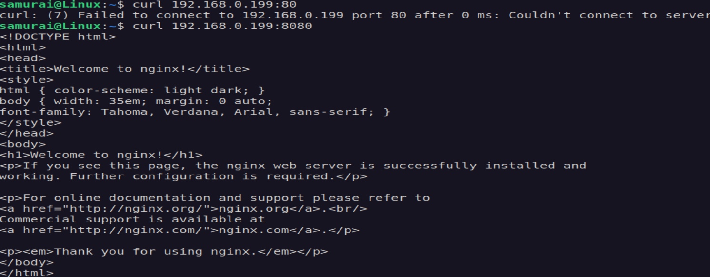
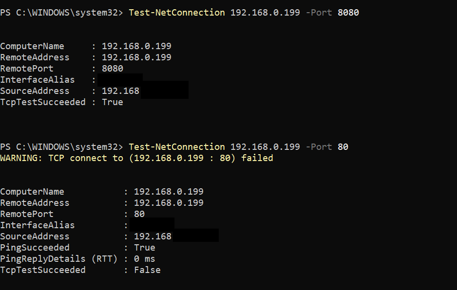

### 🔥 Debugging

1. Check service status:

```bash
systemctl status nginx
```

2. Check listening ports:

```bash
ss -tuln | grep LISTEN
```

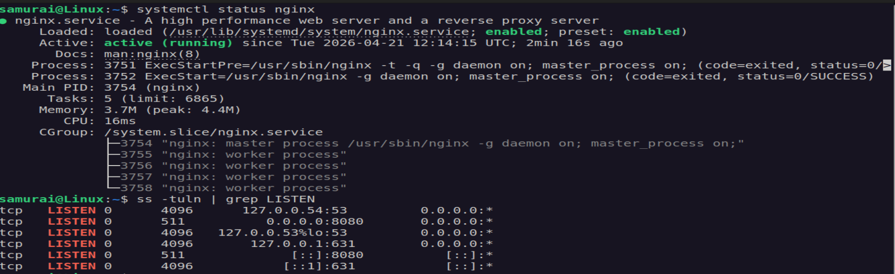

👉 Nginx is NOT listening on port 80

3. Test discovered port locally:

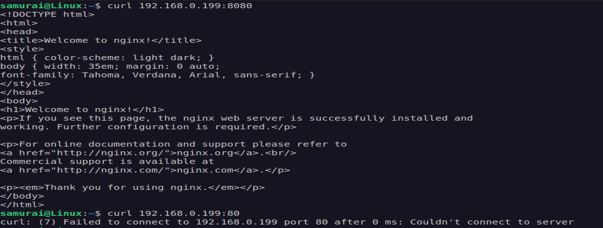

4. Verify from host:


5. Confirm config:

```bash
nginx -T | grep 
```
Expected Outcome:

listen 8080;

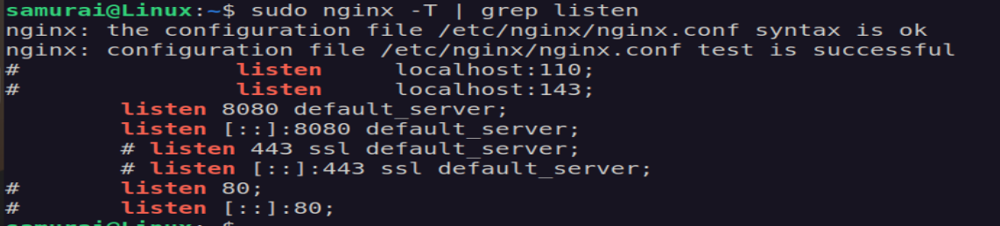


### 🧠 Diagnosis

Service is running on the wrong port -> client is connecting to the wrong port


### 🛠 Fix

Edit config:

```bash
sudo nano /etc/nginx/sites-available/default

listen 80 default_server;
listen [::]:80 default_server;
```

Restart:

```bash
sudo systemtctl restart nginx
```

### ✅ Verification

```bash
ss -tuln | grep :80
```
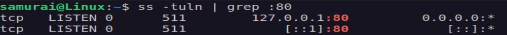

```powershell
Test-NetConnection 192.168.0.199 -Port 80
```


### 🧠 Key lesson

Service may be fully healthy but unreachable due to port mismatch

---

## 🔥 Debugging hierarchy

1. Service (running?)
2. Port (listening?)
3. Binding (where?)
4. Firewall (blocked?)
5. Network (reachable?)


