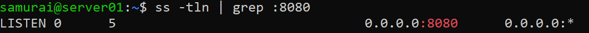
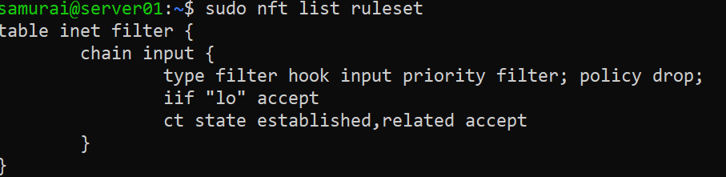
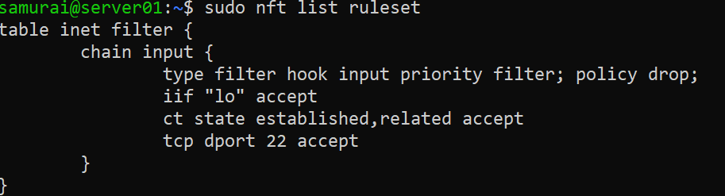
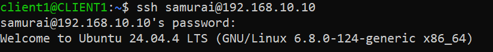
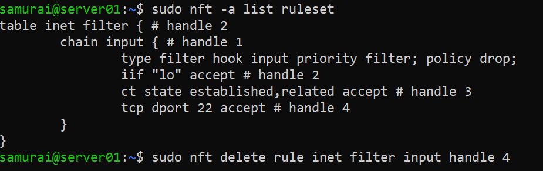
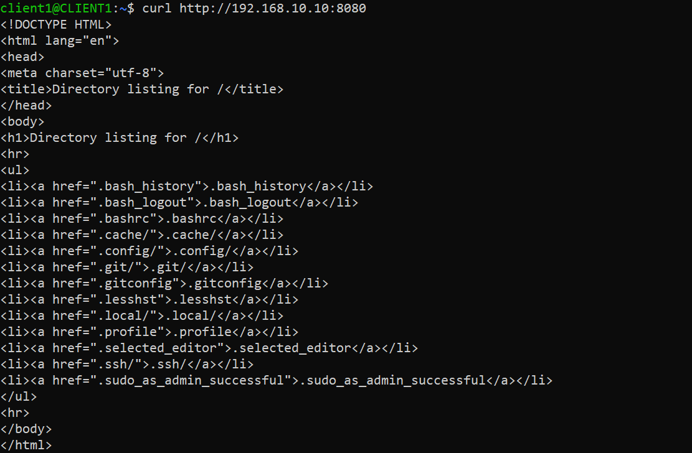
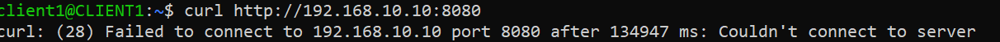
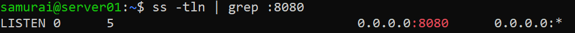
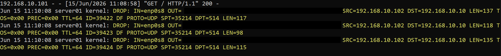

## Objective


---

## Lab Environment

Client VM 1 - 192.168.10.101
Client VM 2 - 192.168.10.102
Server VM - 192.168.10.10

---

## Server Setup

### Step 1 - Run web server

```bash
python3 -m http.server 8080
ss -tln | grep :8080
```


### Step 2 - Base firewall configuration

```bash
sudo nft add table inet filter
sudo nft add chain inet filter input \
'{ type filter hook input priority 0; policy drop; }'
sudo nft add rule inet filter input iif lo accept
sudo nft add rule inet filter input ct state established,related accept
```


---

## Practical Task 1

Objective - Understand how a stateful firewall allows packets belonging to existing connections.

### Step 1 - Add SSH rule

```bash
sudo nft add rule inet filter input tcp dport 22 accept
```


### Step 2 - Connect from Client VM

```bash
ssh user@SERVER_IP
```


### Step 3 - Delete SSH rule

```bash
sudo nft -a list ruleset
sudo nft delete rule inet filter input handle 4
```



Expected Result:

Current SSH session - Works (matches ct state established,related accept)
New SSH session - Blocked (does not match any rule and it's dropped)

---

## Practical Task 2

Objective - Allow access to a web service based on destination port.

### Step 1 - Add HTTP rule

```bash
sudo nft add rule inet filter input tcp dport 8080 accept
```

From Client VM:

```bash
curl http://192.168.10.10:8080
```

Expected Result: HTML page returned



---

EXPERIMENT

### Step 2 - Replace HTTP rule

```bash
sudo nft replace rule inet filter input handle 5 tcp dport 8080 drop 
```

From Client VM:

```bash
curl http://192.168.10.10:8080
```
Expected Result: Connection timed out



IMPORTANT OBSERVATION

Server process is still running:



CONCEPT: Listening service ≠ Reachable service (The firewall decides reachability)

---

## Practical Task 3 - Source IP Filtering 

Objective - Allow only a specific client to access the web server.

### Step 1 - Configuration

```bash
sudo nft add rule inet filter input ip saddr 192.168.10.101 tcp dport 8080 accept
sudo nft add rule inet filter input tcp dport 8080 drop
sudo nft add rule inet filter input log prefix \"DROP: \"
```

### Step 2 - Verification

Run on Client VM 1 and Client VM 2:

```bash
curl http://192.168.10.10:8080
```

Run on Server VM:

```bash
journalctl -f
```



CONCEPT: ACL (Access Control Lists) Traffic can be filtered not only by port but also by source address


