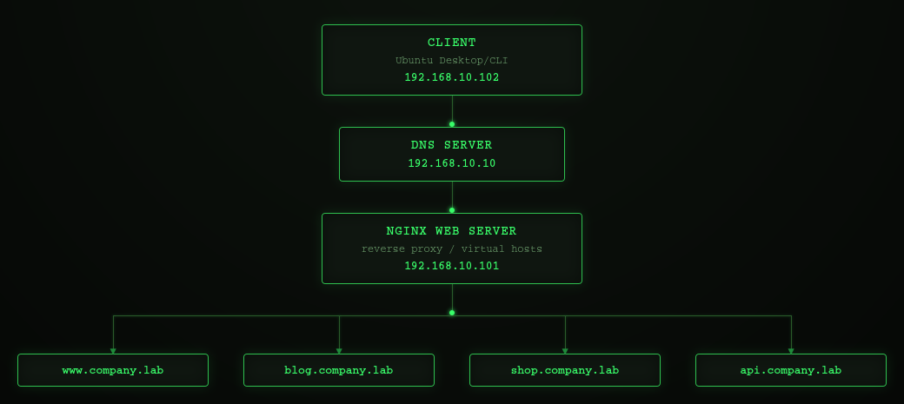
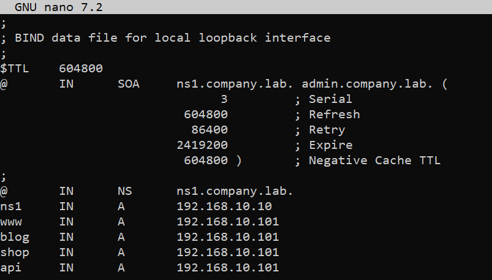
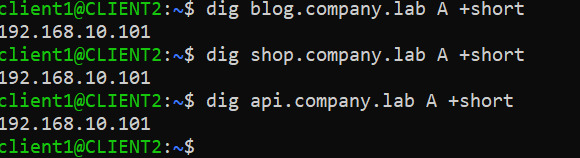
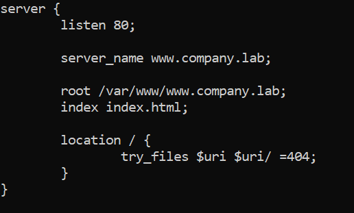
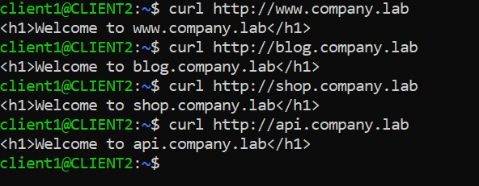

# Hosting Multiple Websites on One Server Using Nginx

## Objective
Host multiple websites on a single web server by combining:

DNS (BIND9)
Nginx Virtual Hosts (Server Blocks)

---

## Environment
- Virtualization: VirtualBox
- OS: ( 1 DNS Server VM + 1 Web Server VM + 1 Client VM)

---

## Network Topology



---

## Prerequisites

This lab builds upon the Private DNS Infrastructure with BIND9 (3-VM Lab). The following components are assumed to already be configured:

* BIND9 installed and running on the DNS server.
* The company.lab DNS zone created and configured.
* The zone file (/etc/bind/db.company.lab) already exists.
* The client is configured to use the internal DNS server (192.168.10.10) via Netplan.
* DNS resolution between the client and the DNS server has been verified.

In this lab, the existing DNS infrastructure is extended by adding additional DNS records and configuring Nginx virtual hosts to host multiple websites on a single web server.

---

## Phase 1 - Add DNS Records

### Step 1 - Edit the Zone file

```bash
sudo nano /etc/bind/db.company.lab
```


Note: Always increment the SOA serial number after editing the zone file.

---

### Step 2 - Validate the Zone

```bash
sudo named-checkzone company.lab /etc/bind/db.company.lab
```
Expected Output: OK

Reload BIND:
```bash
sudo systemctl reload bind9
```

---

## Phase 2 - Verify DNS

From the client:

```bash
dig blog.company.lab A +short
dig shop.company.lab A +short
dig api.company.lab A +short
```

Expected Output: 192.168.10.101



---

## Phase 3 - Create Website Directories

On the webserver:

```bash
sudo mkdir -p /var/www/www.company.lab
sudo mkdir -p /var/www/blog.company.lab
sudo mkdir -p /var/www/shop.company.lab
sudo mkdir -p /var/www/api.company.lab
```

Create simple home pages:

```bash
echo "<h1>Welcome to www.company.lab</h1>" sudo tee /var/www/www.company.lab/index.html
echo "<h1>Welcome to blog.company.lab</h1>" sudo tee /var/www/blog.company.lab/index.html
echo "<h1>Welcome to shop.company.lab</h1>" sudo tee /var/www/shop.company.lab/index.html
echo "<h1>Welcome to api.company.lab</h1>" sudo tee /var/www/api.company.lab/index.html
```
---

## Phase 4 - Configure Nginx Virtual Hosts

### Step 1 - Create the Server Block

```bash
sudo nano /etc/nginx/sites-available/www.company.lab
```


### Step 2 - Enable the website

```bash
sudo ln -s /etc/nginx/sites-available/www.company.lab\
/etc/nginx/sites-enabled/
```

### Step 3 - Validate the configuration

```bash
sudo nginx -t
```
Expected outcome: syntax is ok / test is successful

### Step 4 - Reload Nginx

```bash
sudo systemctl reload nginx
```

Note: Configure the remaining virtual hosts by repeating the Phase 4. Each configuration differs only in two directives (server_name and root)

---

## Phase 5 - Testing

On client:


