# HTTPS with Nginx using a Private Certificate Authority

## Objective
Secure an existing Nginx website using HTTPS and a certificate signed by a private Certificate Authority.

---

## Environment
- Virtualization: VirtualBox
- OS: ( 1 DNS Server VM + 1 Web Server VM + 1 Client VM)

---

## Network Topology


---

## Prerequisites

This lab builds upon the Private DNS Infrastructure with BIND9. The following components are assumed to already be configured:

* BIND9 installed and running on the DNS server.
* The company.lab DNS zone created and configured.
* The zone file (/etc/bind/db.company.lab) already exists.
* The client is configured to use the internal DNS server (192.168.10.10) via Netplan.
* DNS resolution between the client and the DNS server has been verified.

---

## Phase 1 - Verify DNS Resolution

Before enabling HTTPS, verify that DNS resolves the web server correctly.

On the client:

```bash
dig www.company.lab
curl http://www.company.lab
```
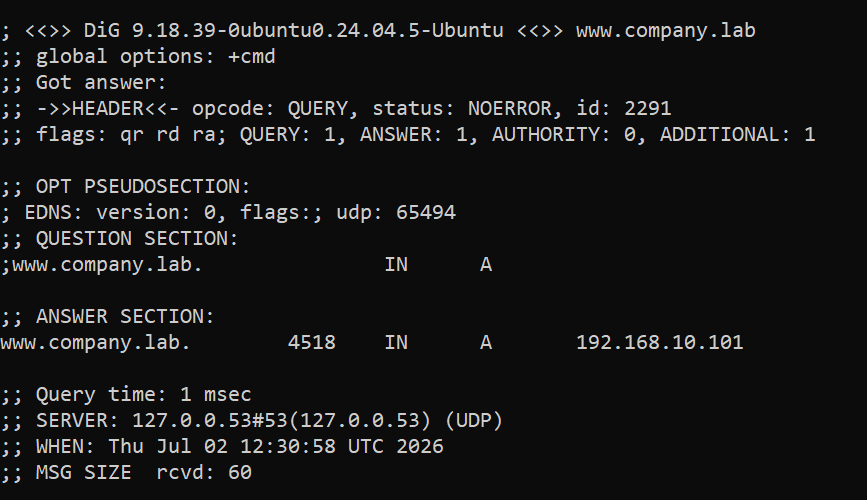


---

## Phase 2 - Create Certificate Authority

### Step 1 - Create a directory

```bash
mkdir ~/ca
cd ~/ca
```

### Step 2 - Generate CA private key

```bash
openssl genrsa -out ca.key 4096
```
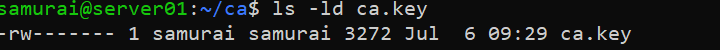

### Step 3 - Create CA certificate

```bash
sudo openssl req -x509 -new -nodes \
-key ca.key \
-sha256 \
-days 3650 \
-out ca.crt
```
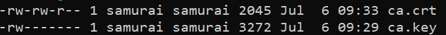

---

## Phase 3 - Create the Web Server Private Key

On the webserver:

### Step 1 - Create a directory

```bash
sudo mkdir -p /etc/nginx/ssl
cd /etc/nginx/ssl
```

### Step 2 - Generate the server's private key

```bash
sudo openssl genrsa \
-out www.company.lab.key \
2048
```
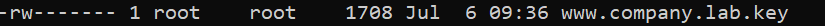

---

## Phase 4 - Create Certificate Signing Request (CSR)

On the webserver:

### Step 1 - Generate the CSR

```bash
sudo openssl req -new \
-key /etc/nginx/ssl/www.company.lab.key \
-out /etc/nginx/ssl/www.company.lab.csr
```

NOTE: For the fields, we use values similar to the CA, but make the Common Name exactly (www.company.lab)

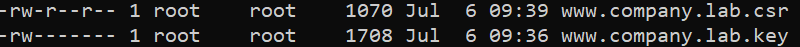

---

## Phase 5 - Sign the CSR

### Step 1 - Copy the CSR to the Certificate Authority

On the webserver:

```bash
scp /etc/nginx/ssl/www.company.lab.csr samurai@192.168.10.10:~/ca
```

### Step 2 - Sign in on the CA

On the DNS server:

```bash
cd ~/ca

sudo openssl x509 \
-in ~/ca/www.company.lab.csr \
-CA ca.crt \
-CAkey ca.key \
-CAcreateserial \
-out www.company.lab.crt \
-days 365 \
-sha256
```
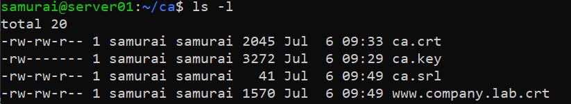

---

## Phase 6 - Deploy the Certificate

### Step 1 - Copy the signed certificate back to the webserver

```bash
scp ~/ca/www.company.lab.crt web-srv@192.168.10.101:/tmp/
```

### Step 2 - On the webserver

```bash
sudo mv /tmp/www.company.lab.crt /etc/nginx/ssl/
```
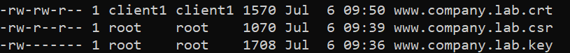

---

## Phase 7 - Configure Nginx

### Step 1 - Configure Nginx to redirect HTTP traffic to HTTPS and use the signed certificate.

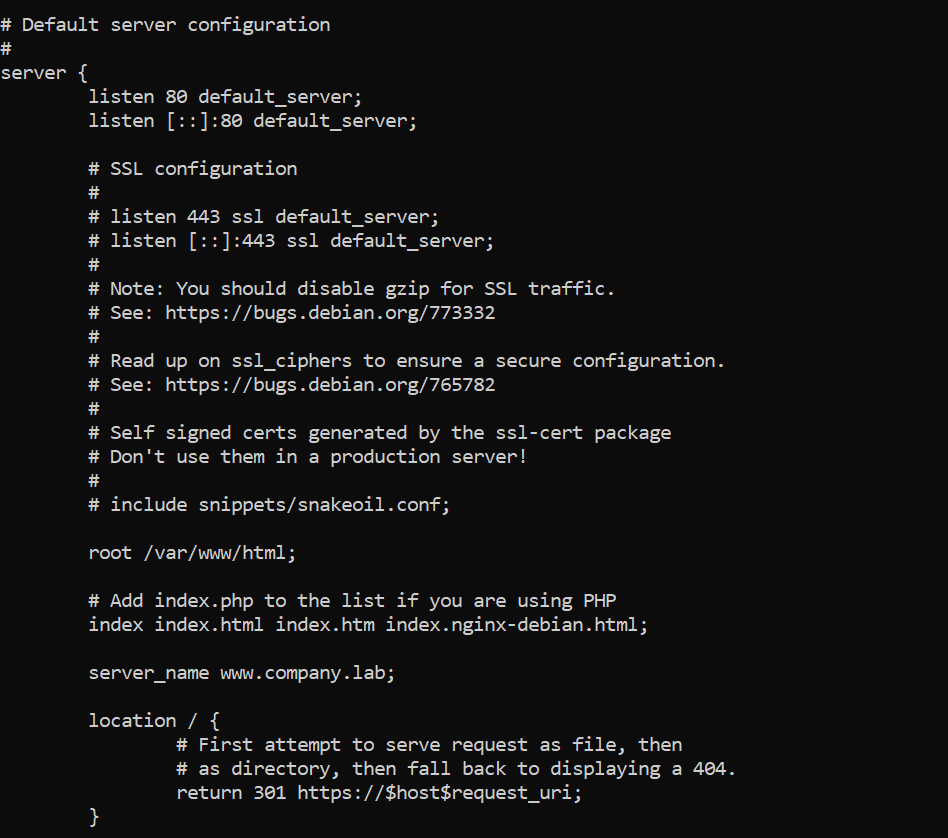
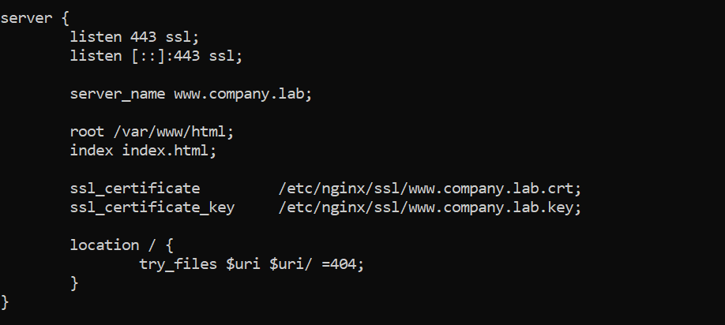

```bash
sudo nginx -t
sudo systemctl reload nginx
```
---

## Phase 8 - Test HTTPS

On client:

```bash
curl -k https://www.company.lab
```
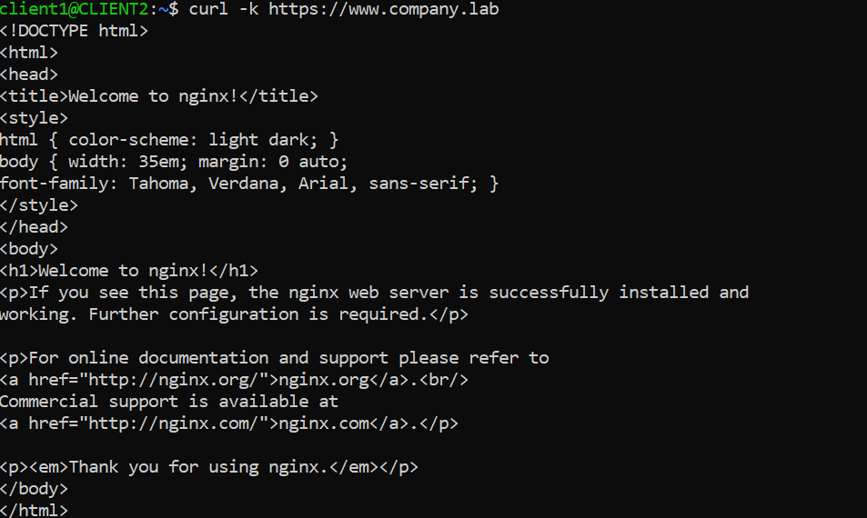

```bash
curl http://www.company.lab
```
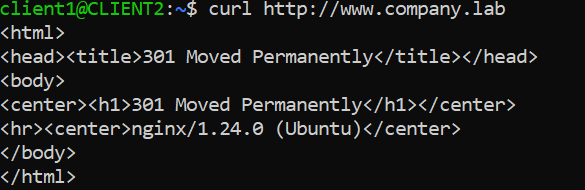

NOTE: The `-k` option tells `curl` to ignore the CA verification.

---

## Phase 9 - Trust the Certificate Authority

### Step 1 - Install the CA certificate 

On DNS server:

```bash
scp /ca/ca.crt client@192.168.10.102:~
```

On client:

```bash
sudo cp ca.crt \
/usr/local/share/ca-certificates/company-lab-ca.crt

sudo update-ca-certificates
```
---

## Phase 10 - Verify trust

### Step 1 - Testing https request

On client:

```bash
curl https://www.company.lab
```

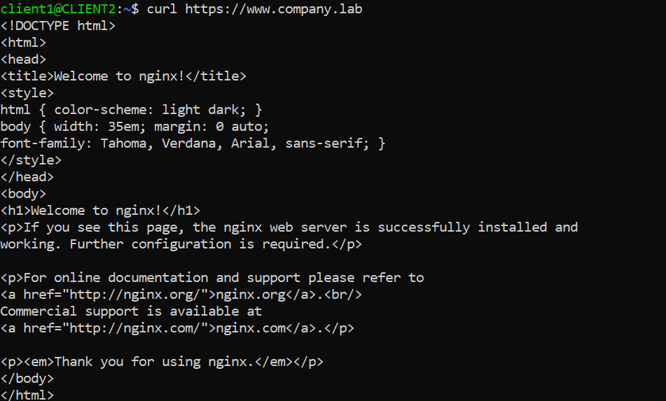

### Step 2 - Inspect the TLS connection

```bash
openssl s_client \
-connect www.company.lab:443 \
-servername www.company.lab
```
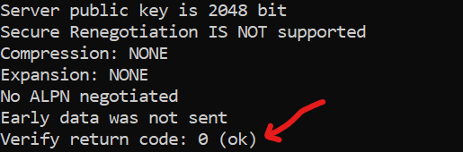
