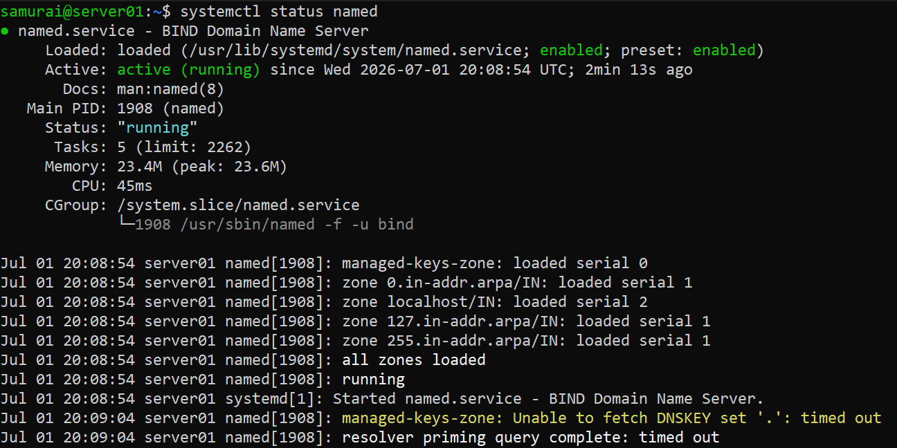
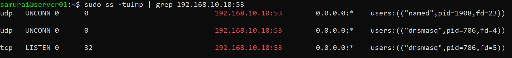
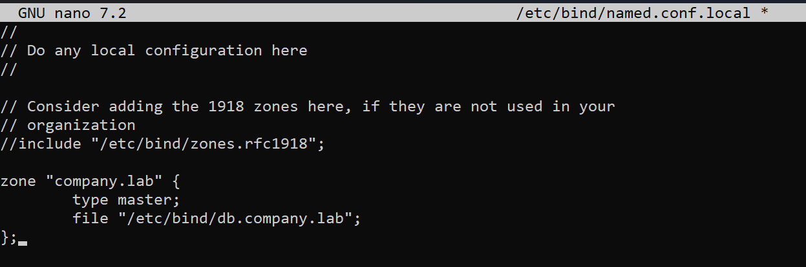
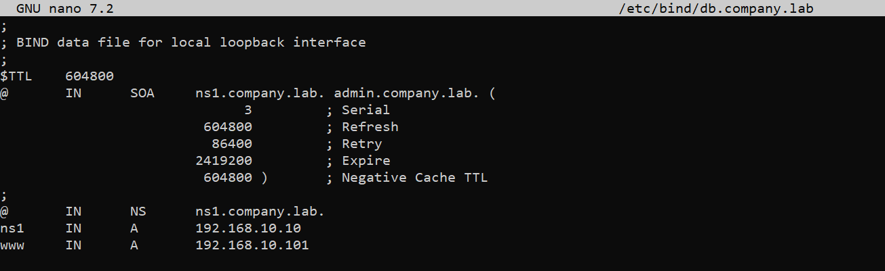
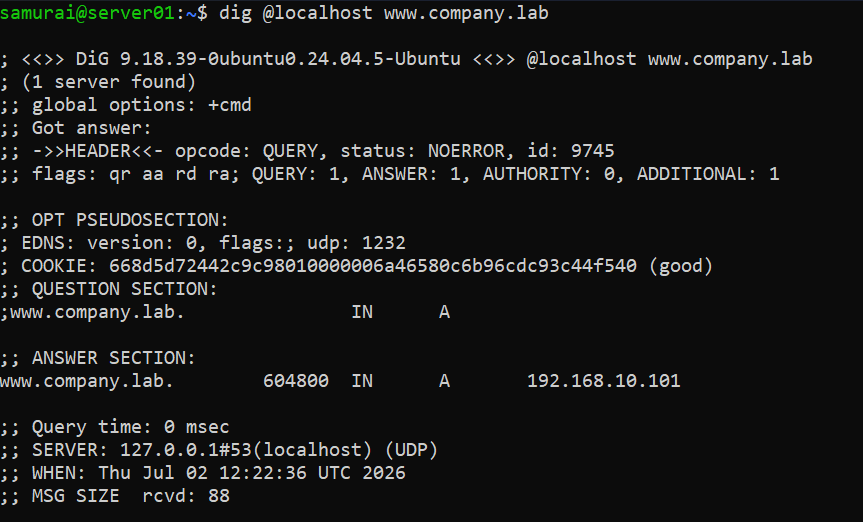
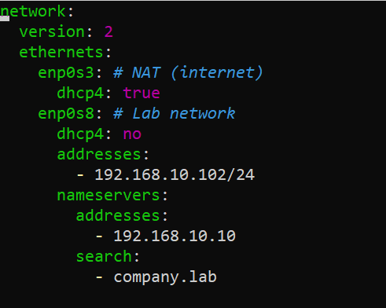
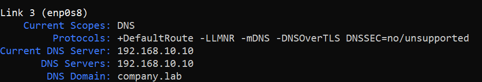
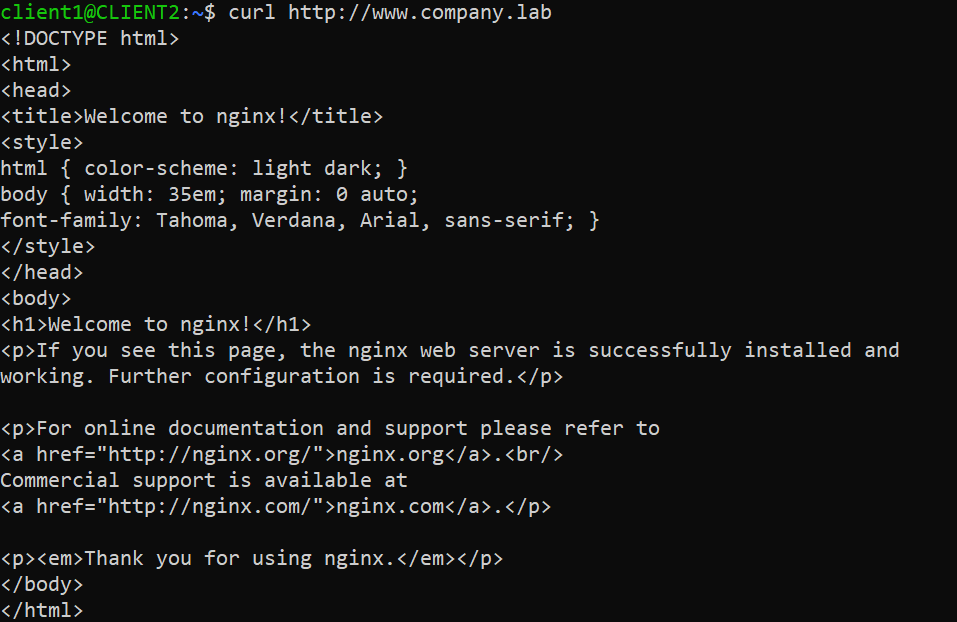
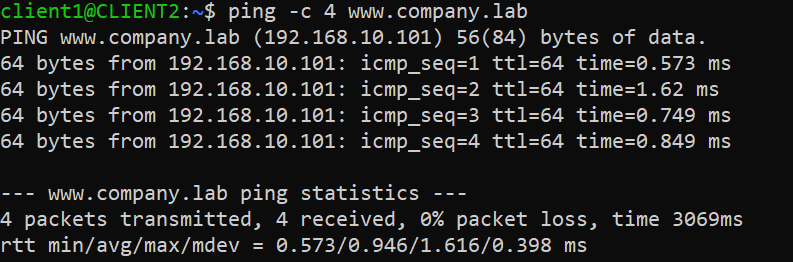

# DNS Lab

## Objective
Build a private DNS infrastructure using BIND9 where:

* A DNS server resolves names in the company.lab domain.
* A web server hosts a website.
* A client uses the DNS server to locate and access the web server.

---

## Environment
- Virtualization: VirtualBox
- OS: ( 1 DNS Server VM + 1 Web Server VM + 1 Client VM)

---

## Network Topology


---

## Phase 1 - Configure DNS Server

### Step 1 - Install BIND9 and verify

```bash
sudo apt update
sudo apt install bind9 bind9-utils dnsutils
sudo systemctl status named/bind9
ss -tulnp | grep 192.168.10.10:53
```



---

### Step 2 - Create DNS Zone

```bash
sudo nano /etc/bind/named.conf.local
```


---

### Step 3 - Create Zone file

```bash
sudo cp /etc/bind/db.local /etc/bind/db.company.lab
sudo nano /etc/bind/db.company.lab
```


---

### Step 4 - Validate configuration and zone

```bash
sudo named-checkconf
```
Expected: no output

```bash
sudo named-checkzone company.lab /etc/bind/db.company.lab
```
Expected: OK

Reload BIND:
```bash
sudo systemctl reload bind9
```

---

### Step 5 - Test DNS Server

```bash
dig @localhost www.company.lab
```


---

## Phase 2 - Configure Web Server

### Step 1 - Install Nginx

```bash
sudo apt update
sudo apt install nginx
sudo systemctl status nginx
```

---

## Phase 3 - Configure Client

### Step 1 - Edit netplan:

```bash
sudo nano /etc/netplan/01-netcfg.yaml
sudo netplan apply
```


### Step 2 - Verify DNS resolution

```bash
resolvectl status
```


### Step 3 - Test 

```bash
dig www.company.lab
curl http://www.company.lab
ping -c4 www.company.lab
```



