# 🧪 Process Management & Resource Control Lab

## 📌 Objective
Simulate and troubleshoot a real-world system slowdown caused by CPU saturation and memory exhaustion.

---

## ⚙️ Environment
- Virtualization: VirtualBox
- OS: Ubuntu Server 

---

## 🛠️ Lab Setup

### Step 1 - Create CPU Load Script

```bash
nano cpu_hog.sh
chmod +x cpu_hog.sh
```

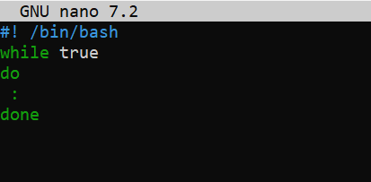

---

### Step 2 - Create Memory Load Script (Python)

```bash
nano mem_hog.py
chmod +x mem_hog.py
```

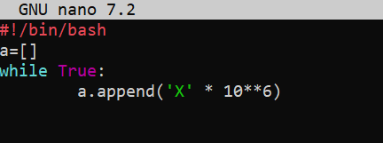

---

## 🚨 Incident Simulation

### Step 1 - Check the System Load Baseline

```bash
uptime
```


---

### Step 2 - Run the scripts

```bash
./cpu_hog.sh &
python3 mem_hog.py &
```

---

## 🔍 Investigation

### Step 1 - Check System Load

``bash
uptime
```


---

### Step 2 - Monitor Processes

```bash
htop
```

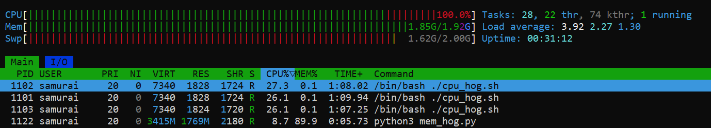

---

### Step 3 - Identify Top Resource Consumers

```bash
ps aux --sort=-%cpu | head
ps aux --sort=-%mem | head
```

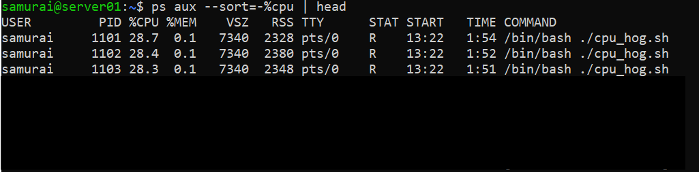

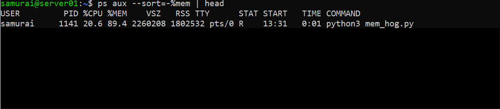

---

## 🧠 Analysis

### **System State**
- **CPU:** Fully saturated by multiple cpu_hog.sh processes
- **Memory:** Exhausted due to mem_hog.py
- **Swap:** Fully utilized (~2GB)
- **Kernel Action:** OOM killer terminates mem_hog.py

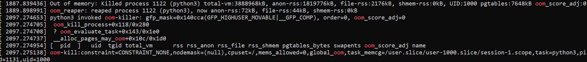

### **Key Observations***
- CPU saturation causes system lag
- Memory exhaustion triggers OOM killer
- High swap usage leads to severe performance degradation
- Multiple processes contribute to system overload

---

## ✅ Remediation

### Step 1 - Kill CPU-Intensive Processes

```bash
kill cpu-hog.sh
```

### Step 2 - Verify Memory Status

```bash
free -h
```

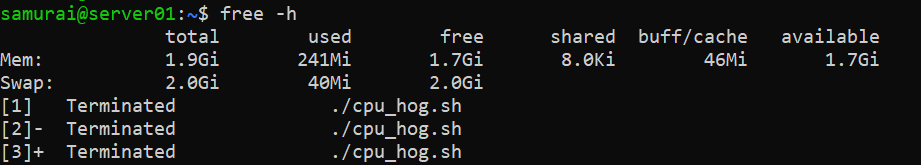

### Step 3 - Confirm Recovery

```bash
uptime
htop
```

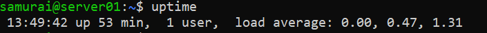
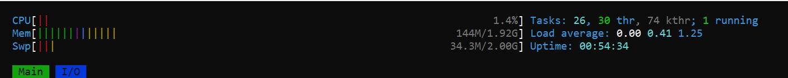

---

## 🧪 Experiment (Level 1) - Make the problem less obvious

### 🛠️ Setup (Disguise the process)

```bash
mv cpu_hog.sh systemd-helper

./systemd-helper &
```
---

## 🔎 Investigation

### Step 1 - Check System Load

```bash
uptime
```
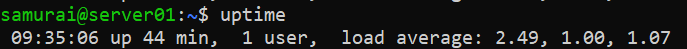

---

### Step 2 - Monitor Processes

```bash
htop
```
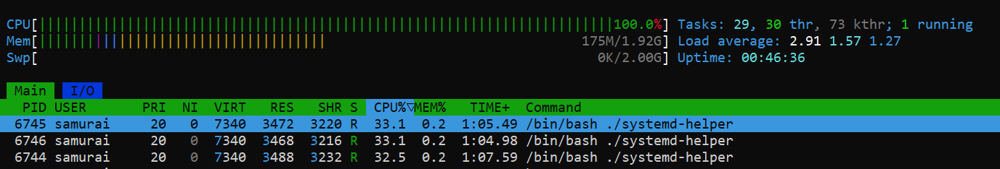

**Conclusion:** The system slowdown is caused by a CPU-bound workload, not memory pressure.

---

### Step 3 - What is this process

```bash
ps aux | grep systemd-helper
which systemd-helper
ls -l /proc/<PID>/exe
```

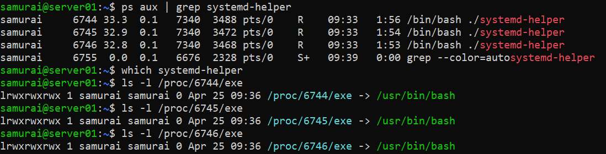

**Conclusion:** The process is a shell script executed via bash, not a compiled system binary. The process is not installed system-wide and is not part of standard system tools. The process is running through the bash interpreter, confirming it is a script, not a native executable.

---

### Step 4 - Who is running it

```bash
ps -o user,pid,cmd -p <PID>
```

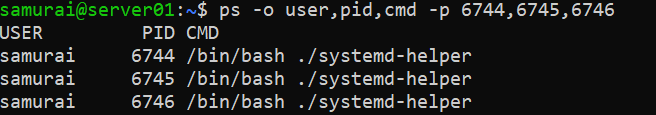

**Conclusion:** The script is executed from a local directory (./), which is atypical for legitimate system services.

---

### Step 5 - What is the command exactly

```bash
ps -fp <PID>
```

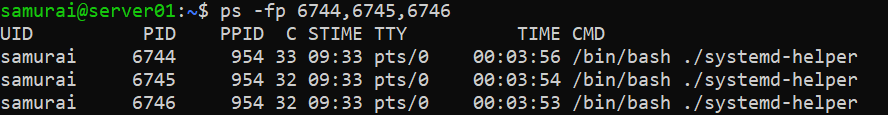

---

### Step 6 - Check parent process

```bash
pstree -p <PID>
```

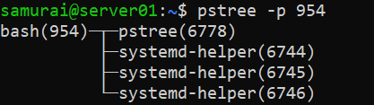

**Conclusion:** The process is a child of a bash shell, meaning it was launched from an interactive or script-based shell session, not by a system manager like systemd

---

## 🧠 Final Summary
- CPU is fully saturated → confirms system slowdown source
- Process is a bash script, not a system binary
- Not found in system PATH → not an installed service
- Executed from local directory → suspicious / non-standard
- Parent service (bash) → not part of system infrastructure 

---

## 🧾 Final Diagnosis

The system slowdown is caused by a manually executed shell script (systemd-helper) consuming excessive CPU. The process is not a legitimate system service and operates outside standard system management.

---

## ⚖️ Final Decision

The process is safe to terminate, as it is:
- Non-critical
- User-executed
- Resource-intensive
- Directly responsible for system degradation

---

## 🧪 Experiment (Level 2) - Persistent Process

### 🛠️ Setup (Persistant process)

```bash
nano restart_cpu.sh

./restart_cpu.sh &
```
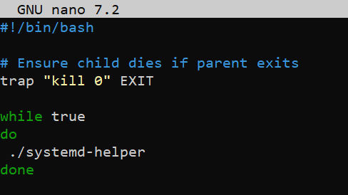

---

## 🔎 Investigation

### Step 1 - Check System Load

```bash
uptime
```


---

### Step 2 - Monitor Processes

```bash
htop
```
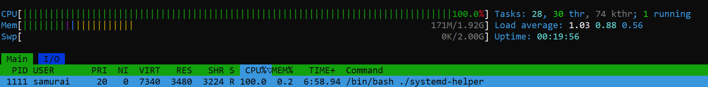

**Conclusion:** The system slowdown is caused by a CPU-bound workload.

---

### Step 3 - Identify top process

```bash
ps aux --sort=-%cpu | head
```

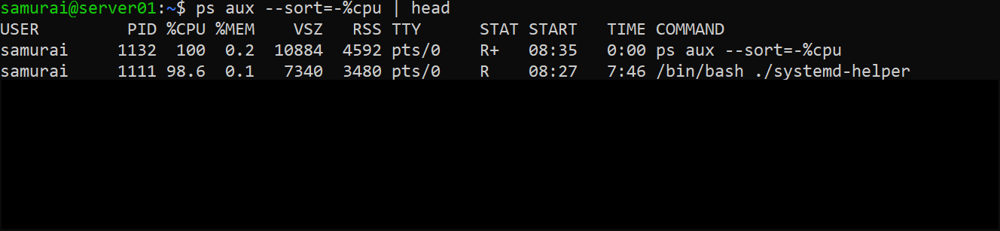

---

### Step 4 - Inspect process details

```bash
ps -fp <PID>
```

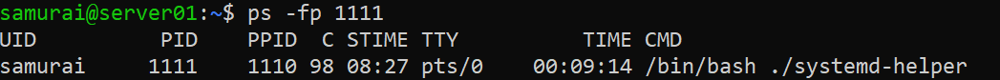

---

### Step 5 - Verify process legitimacy

```bash
ls -l /proc/<PID>/exe
```

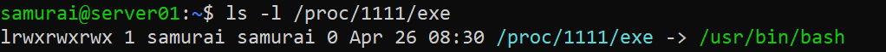

**Conclusion:** The process is a shell script executed via bash, not a compiled system binary. The process is not installed system-wide and is not part of standard system tools. The process is running through the bash interpreter, confirming it is a script, not a native executable.

---

### Step 6 - Analyze process hierarchy

```bash
pstree -p
```

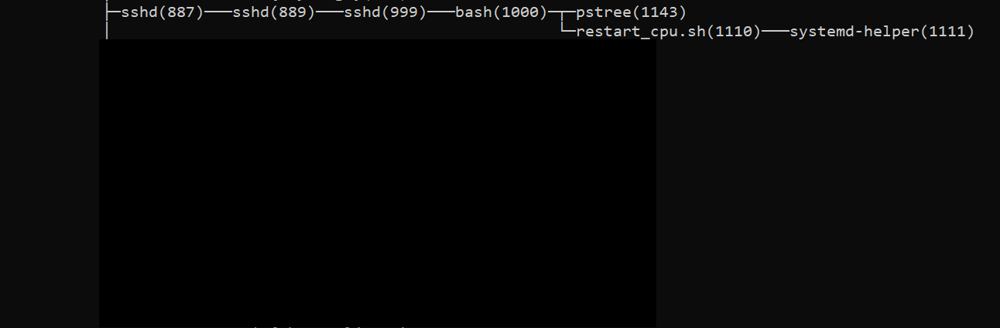

---

### Step 7 - Test process behavior

```bash
kill <child_PID>
```

**Conclusion:** The process (./systemd-helper) is being respawned (persistent)

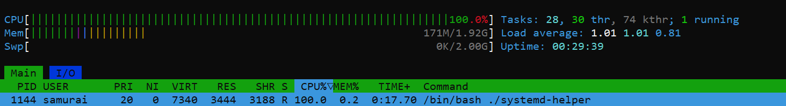

---

### Step 8 - Identify root cause

```bash
ps -fp <parent_PID>
```

**Conclusion:** The script (restart_cpu.sh) is responsible for restarting child. The parent process (./restart_cpu.sh) is the true source of persistence

---

## ✅ Remediation

### Step 1 - Kill parent process

```bash
kill <parent PID>
```

**Expected outcome:**
- Child process stops
- CPU usage drops

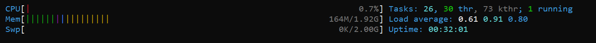


---

