# 🧪 Process Management & Resource Control Lab

## 📌 Objective
Simulate and troubleshoot a real-world system slowdown caused by CPU saturation and memory exhaustion.

---

## ⚙️ Environment
- Virtualization: VirtualBox
- OS: Ubuntu Server 

---

## 🛠️ Lab Setup

### Step 1 - Create CPU Load Script

```bash
nano cpu_hog.sh
chmod +x cpu_hog.sh
```


---

### Step 2 - Create Memory Load Script (Python)

```bash
nano mem_hog.py
chmod +x mem_hog.py
```


---

## 🚨 Incident Simulation

### Step 1 - Check the System Load Baseline

```bash
uptime
```


---

### Step 2 - Run the scripts

```bash
./cpu_hog.sh &
python3 mem_hog.py &
```

---

## 🔍 Investigation

### Step 1 - Check System Load

``bash
uptime
```


---

### Step 2 - Monitor Processes

```bash
htop
```


---

### Step 3 - Identify Top Resource Consumers

```bash
ps aux --sort=-%cpu | head
ps aux --sort=-%mem | head
```


---

## 🧠 Analysis

### **System State**
- **CPU:** Fully saturated by multiple cpu_hog.sh processes
- **Memory:** Exhausted due to mem_hog.py
- **Swap:** Fully utilized (~2GB)
- **Kernel Action:** OOM killer terminates mem_hog.py


### **Key Observations***
- CPU saturation causes system lag
- Memory exhaustion triggers OOM killer
- High swap usage leads to severe performance degradation
- Multiple processes contribute to system overload

---

## ✅ Remediation

### Step 1 - Kill CPU-Intensive Processes

```bash
kill cpu-hog.sh
```

### Step 2 - Verify Memory Status

```bash
free -h
```


### Step 3 - Confirm Recovery

```bash
uptime
htop
```


---

## 🧪 Experiment (Level 1) - Make the problem less obvious

### 🛠️ Setup (Disguise the process)

```bash
mv cpu_hog.sh systemd-helper

./systemd-helper &
```
---

## 🔎 Investigation

### Step 1 - Check System Load

```bash
uptime
```


---

### Step 2 - Monitor Processes

```bash
htop
```


**Conclusion:** The system slowdown is caused by a CPU-bound workload, not memory pressure.

---

### Step 3 - What is this process

```bash
ps aux | grep systemd-helper
which systemd-helper
ls -l /proc/<PID>/exe
```


**Conclusion:** The process is a shell script executed via bash, not a compiled system binary. The process is not installed system-wide and is not part of standard system tools. The process is running through the bash interpreter, confirming it is a script, not a native executable.

---

### Step 4 - Who is running it

```bash
ps -o user,pid,cmd -p <PID>
```


**Conclusion:** The script is executed from a local directory (./), which is atypical for legitimate system services.

---

### Step 5 - What is the command exactly

```bash
ps -fp <PID>
```


---

### Step 6 - Check parent process

```bash
pstree -p <PID>
```


**Conclusion:** The process is a child of a bash shell, meaning it was launched from an interactive or script-based shell session, not by a system manager like systemd

---

## 🧠 Final Summary
- CPU is fully saturated → confirms system slowdown source
- Process is a bash script, not a system binary
- Not found in system PATH → not an installed service
- Executed from local directory → suspicious / non-standard
- Parent service (bash) → not part of system infrastructure 

---

## 🧾 Final Diagnosis

The system slowdown is caused by a manually executed shell script (systemd-helper) consuming excessive CPU. The process is not a legitimate system service and operates outside standard system management.

---

## ⚖️ Final Decision

The process is safe to terminate, as it is:
- Non-critical
- User-executed
- Resource-intensive
- Directly responsible for system degradation

---

## 🧪 Experiment (Level 2) - Persistent Process

### 🛠️ Setup (Persistant process)

```bash
nano restart_cpu.sh

./restart_cpu.sh &
```


---

## 🔎 Investigation

### Step 1 - Check System Load

```bash
uptime
```


---

### Step 2 - Monitor Processes

```bash
htop
```


**Conclusion:** The system slowdown is caused by a CPU-bound workload.

---

### Step 3 - Identify top process

```bash
ps aux --sort=-%cpu | head
```


---

### Step 4 - Inspect process details

```bash
ps -fp <PID>
```


---

### Step 5 - Verify process legitimacy

```bash
ls -l /proc/<PID>/exe
```


**Conclusion:** The process is a shell script executed via bash, not a compiled system binary. The process is not installed system-wide and is not part of standard system tools. The process is running through the bash interpreter, confirming it is a script, not a native executable.

---

### Step 6 - Analyze process hierarchy

```bash
pstree -p
```


---

### Step 7 - Test process behavior

```bash
kill <child_PID>
```

**Conclusion:** The process (./systemd-helper) is being respawned (persistent)


---

### Step 8 - Identify root cause

```bash
ps -fp <parent_PID>
```
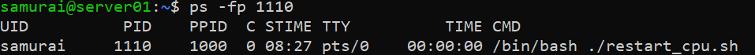

**Conclusion:** The script (restart_cpu.sh) is responsible for restarting child. The parent process (./restart_cpu.sh) is the true source of persistence

---

## ✅ Remediation

### Step 1 - Kill parent process

```bash
kill <parent PID>
```

**Expected outcome:**
- Child process stops
- CPU usage drops


---

## 🧪 Experiment (Level 3) - Misleading Signal: Disk I/O Noise

### 🛠️ Setup (Misleading signal)

```bash
nano disk_worker
chmod +x disk_worker
```
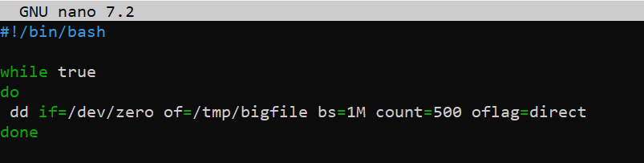

**Run:**

```bash
./disk_worker > /dev/null 2>&1 &
./restart_cpu.sh > /dev/null 2>&1 &
```
---

## 🔎 Investigation

### Step 1 - Check System Load

```bash
uptime
```
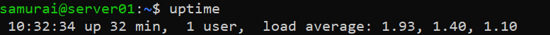

**Observation**
Load average is elevated

**Conclusion:**
System is under load and requires investigation

---

### Step 2 - Monitor Processes

```bash
htop
```
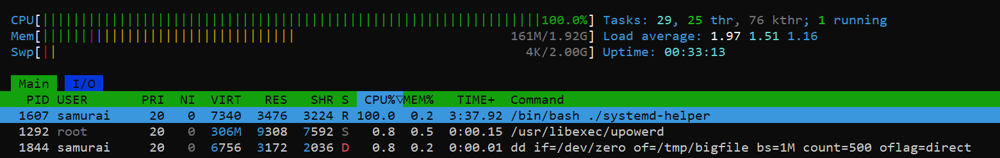

**Observation**
- ./systemd-helper ≈ 100% CPU
- dd ≈ ~0.8% CPU
- Memory usage stable (~161MB/2GB)

**Conclusion:**
CPU saturation is dominated by a single process (systemd-helper). Disk-related processes (dd) exist but contribute minimal CPU usage. Initial-signal: CPU-bound issue

---

### Step 3 - Cross-check top CPU consumers

```bash
ps aux --sort=-%cpu | head
```

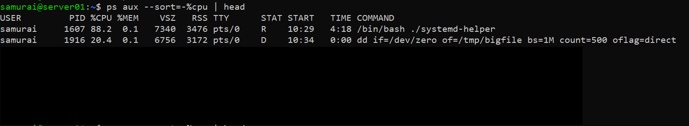

**Observation**
- ./systemd-helper ≈ 88% CPU
- dd ≈ ~20% CPU

**Conclusion:**
CPU usage confirms:
- systemd-helper is a consistent high consumer
- dd contributes CPU intermittently (burst behavior)

---

### Step 4 - Check disk activity 

```bash
iotop-c
```
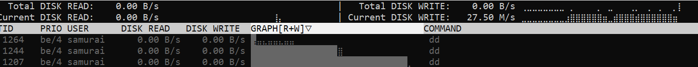

**Observation**
- Multiple dd processes appear
- I/O usage visibly active (graph column moving)

**Conclusion:**
Disk I/O is actively being generated, primarily by dd. However, presence of activity ≠ proof of bottleneck.

---

### Step 5 - Detect process behavior pattern

```bash
pgrep -a dd
```

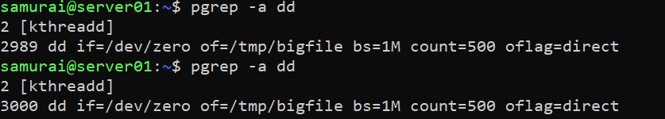

**Observation**
- Multiple PIDs for dd
- Processes appear and disappear rapidly

**Conclusion:**
dd is a short-lived worker process, likely spawned in a loop. It's not a stable root process -> must trace parent

---

### Step 6: Trace process origin

**Method A - Real time capture**

```bash
watch -n 0.5 "ps -o pid,ppid,cmd -C dd"
```

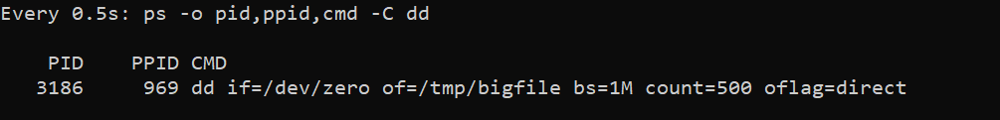

---

**Method B - Process tree**

```bash
pstree -p | grep dd
```

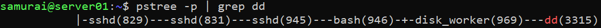

---

**Method C - Manual tracing**

```bash
ps -fp <PPID>
```

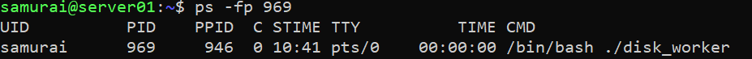

**Observation**
- dd processes originate from a parent script (disk-worker)

**Conclusion:**
dd is a child process, not root cause. A controller script is responsible for generating disk load.

---

## 🧠 Interim Analysis

Signals observed:
- CPU -> heavily saturated by systemd-helper
- Disk -> active due to dd
- Memory -> stable

**Interpretation:**
CPU load is continuous and dominant
Disk activity is real but secondary/bursty

---

## 🎯 Hypothesis

**H1 - CPU is the primary bottleneck**

System slowdown is caused by systemd-helper

**H2 - Disk I/O is the primary bottleneck**

System slowdown is caused by dd activity

---

### Test Disk Hypothesis (H2)

```bash
kill <disk_worker PID>
```

**Observation**
- dd processes disappear
- Disk activity drops
- systemd-helper still consuming ~ 100% CPU
- System remains slow

**Conclusion:**
Disk I/O is not the primary cause, it's a secondary signal (noise)

---

### Test CPU Hypothesis (H1)

```bash
pstree -p | grep systemd-helper
kill <restart_cpu.sh PID>
``` 

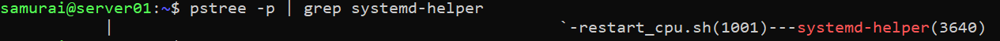


**Observation**
- systemd-helper disappears
- CPU usage drops significantly
- System responsiveness improves immediately

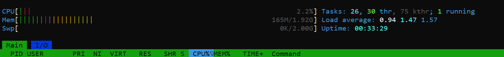


**Conclusion:**
CPU saturation is the PRIMARY cause. systemd-helper is the root problem.

---

## 🧠 Final Diagnosis

- Primary cause -> CPU saturation (systemd-helper)
- Secondary noise -> Disk I/O (dd via disk-worker)

---

## Debugging Workflow

1. Detect system stress (uptime)
2. Identify dominant resource (htop)
3. Cross-check processes (ps)
4. Identify process behavior (stable vs bursty)
5. Trace parent processes (pstree / watch)
6. Form hypothesis
7. Test by removing one factor at a time
8. Observe system response
9. Confirm root cause

---

## 🧪 Experiment (Level 4) - Delayed Failure

### 🛠️ Setup (Delayed Failure)

1. Create delayed CPU worker

```bash
nano analytics_worker.py
chmod +x analytics_worker.py
```

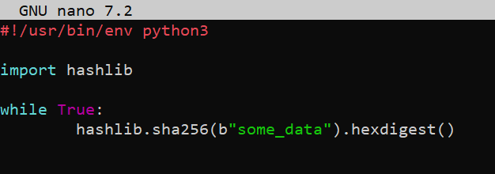

2. Create delayed launcher

```bash
nano delayed_start.sh
chmod +x delayed_start.sh
./delayed_start.sh > /dev/null 2>&1 &
```

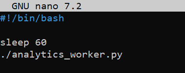

---

## 🧠 Phase 1 — Initial State

```bash
htop
ps aux --sort=-%cpu | head
```
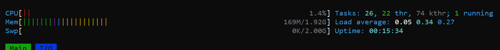

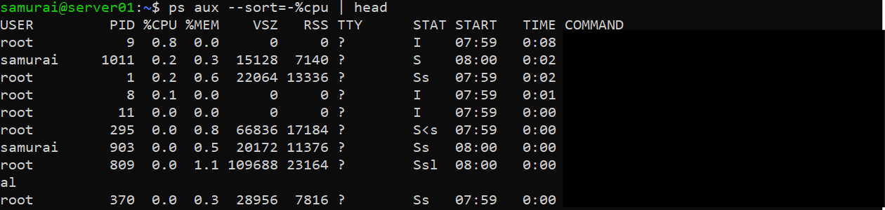

**Observation**
- System is responsive
- CPU normal
- No obvious suspicious processes

**Conclusion:**
- No immediate issue detected
- System appears healthy

---

## ⏱️ Phase 2 — Degradation State

```bash
htop
ps aux --sort=-%cpu | head
```

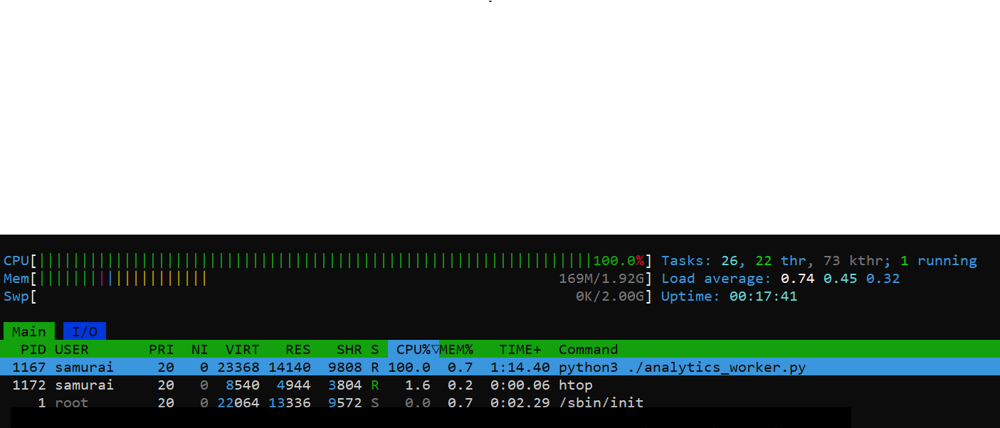

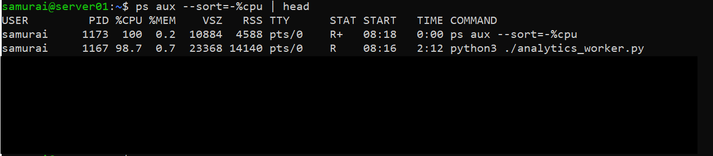

**Observation**
- analytics_worker.py now consuming ~100% CPU

**Conclusion:**
- Issue is time-triggered, not constant
- Requires correlation with recent activity

---

## 🔎 Investigation

### Step 1 - Identify new processes

```bash
ps -eo pid,lstart,cmd --sort=start_time | tail
```

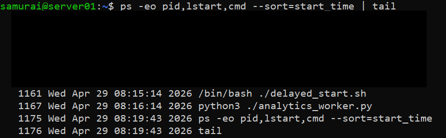

**Observation**
- analytics_worker.py started recently

**Conclusion:**
Newly started process correlates with system degradation

---

### Step 2 - Trace origin

```bash
ps -fp <PID>
pstree -p
```

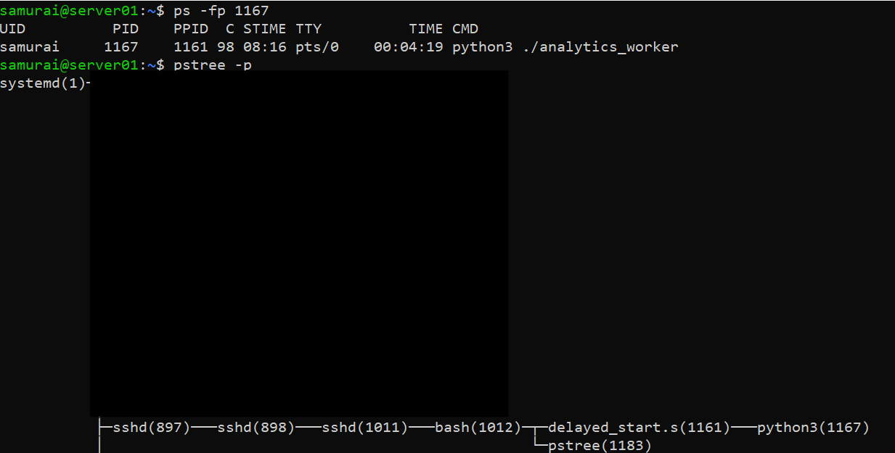

**Observation**
- Parent process (delayed_start.sh)

**Conclusion:**
Root cause is delayed execution script, not just the worker

---

## ✅ Remediation

Kill either child or parent process

```bash
kill <analytics_worker PID>
kill <delayed_start.sh PID>
```

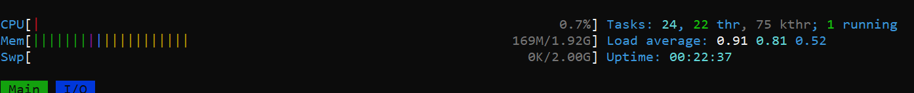

---

## 🧪 Experiment (Level 5) - Resource Prioritization

## 📌 Objective
To understand how Linux CPU scheduling priority affects process behavior under load.

---

## ⚙️ Setup

### Step 1 - Start normal priority CPU process (baseline)

```bash
./systemd-helper &
```

**Default priority:**
Normal CPU scheduling priority (0)

---

Step 2 - Start low-priority CPU process

```bash
nice -n 15 ./systemd-helper &
```

**Meaning:**
- nice 15 = lower priority than default
- scheduler deprioritizes this process under load

---

## 🔍 Investigation

### Step 1 - Observe CPU behavior

```bash
htop
```

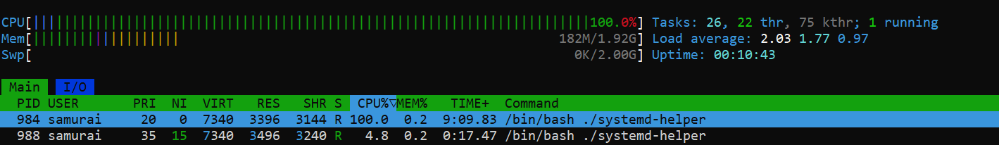

**Observation**
- Process (NI = 0) -> ~98% CPU
- Process (NI = 15) -> ~3% CPU

**Conclusion:**
Under CPU saturation, the scheduler allocates significantly more CPU time to the process with lower nice value (higher scheduling priority).

---

### Step 2 - Inspect process priority

```bash
ps -o pid,ni,pri,cmd -C systemd-helper
```

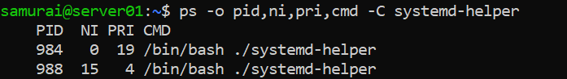

**Observation**
- NI = 0 -> PRI ≈ 19
- NI = 15 -> PRI ≈ 4


**Conclusion:**
ps PRI represents the kernel's internal scheduling priority, which is dynamically derived from the niceness value. It is not directly comparable to htop PR, which uses a simplified user-level mapping (PR ≈ 20 + NI)

---

### Step 3 - Apply system stress 

Start additional load:

```bash
./systemd-helper &
```

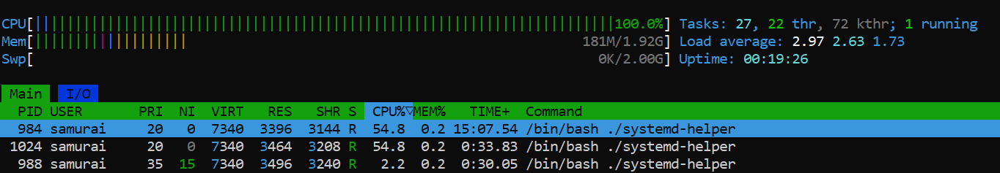

**Observation**
- with increased load, CPU competition becomes more visible
- NI = 0 processes consistently dominate CPU usage
- NI = 15 process receives significantly fewer CPU time slices

**Concluion:**
Under high system contention, the scheduler enforces priority dofferences more aggressively, making niceness effects clearly observable. 

---

### Step 4 - Validate CPU distribution

```bash
ps -eo pid,ni,pri,pcpu,cmd | grep systemd-helper
```

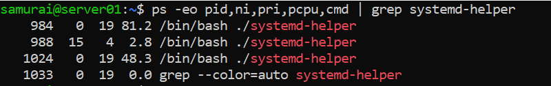

**Observation**
- NI = 0 processes -> higher %CPU
-  NI = 15 process -> significantly lower %CPU

**Conclusion:**
CPU usage distribution confirms scheduler bias: lower nice values receive more CPU time under load, and this difference becomes measurable over time.

---

## 🧠 Final Insight
- htop shows real-time CPU distribution
- ps PRI shows kernel scheduling priority
- nice only influences CPU scheduling weight, not execution capability
- Differences become visible only under CPU contention
