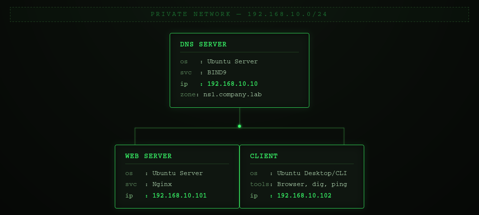
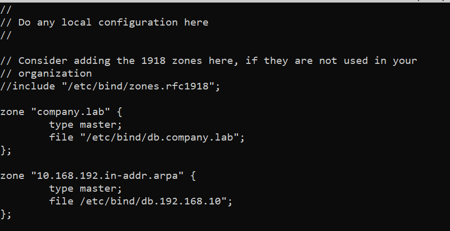
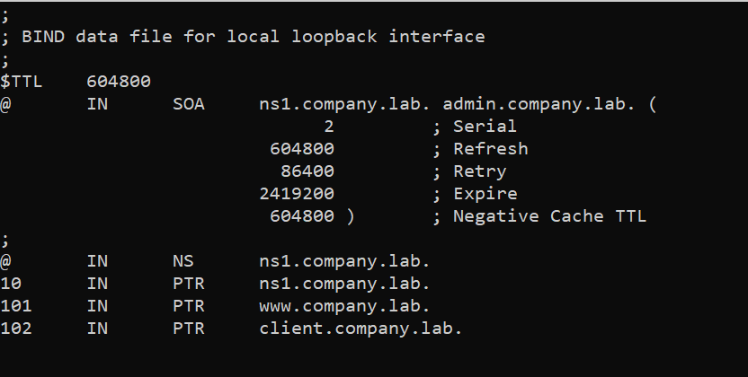
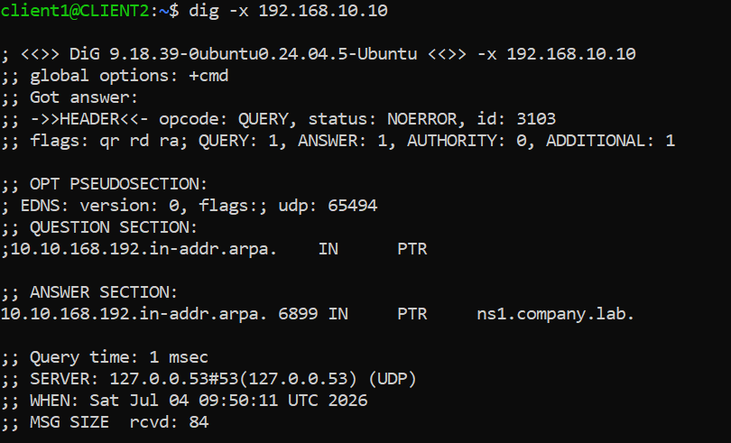
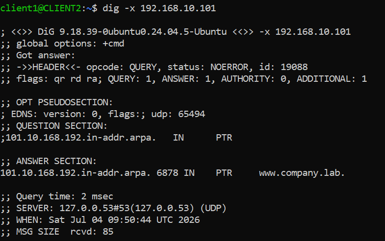
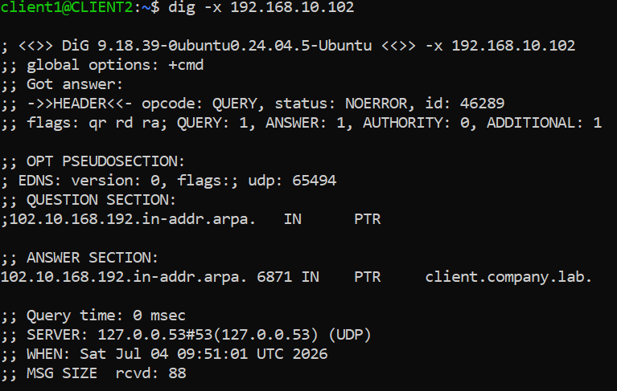

# Configuring Reverse DNS (PTR Records) with BIND9

## Objective
Extend the existing private DNS infrastructure by configuring Reverse DNS (PTR records). This enables IP addresses to be resolved back to hostnames, complementing the forward lookup zone created in previous labs.

By the end of this lab, the DNS server will support both:

* Forward lookups (hostname → IP address)
* Reverse lookups (IP address → hostname)

---

## Environment
- Virtualization: VirtualBox
- OS: ( 1 DNS Server VM + 1 Web Server VM + 1 Client VM)

---

## Network Topology



---

## Prerequisites

This lab builds upon the following previous labs:

* Building a Private DNS Infrastructure with BIND9
* Hosting Multiple Websites on One Server Using Nginx Virtual Hosts

The following components are assumed to already be configured:

* BIND9 is installed and running on the DNS server.
* The forward lookup zone company.lab has already been created.
* The forward zone file (/etc/bind/db.company.lab) contains the required DNS records.
* The client is configured to use the internal DNS server (192.168.10.10).
* DNS resolution between all virtual machines has been verified.
* The web server hosts multiple virtual websites using Nginx.

This lab extends the existing DNS infrastructure by adding a reverse lookup zone.

---

## Background

A forward DNS lookup translates a hostname into an IP address.

Example:

www.company.lab
        │
        ▼
192.168.10.101

A reverse DNS lookup performs the opposite operation.

192.168.10.101
        │
        ▼
www.company.lab

Reverse DNS uses PTR (Pointer) records instead of A records.

Unlike forward lookups, reverse lookups are stored in a separate DNS namespace called in-addr.arpa.

---

## Phase 1 - Configure the Reverse Lookup Zone

### Step 1 - Edit the BIND configuration

```bash
sudo nano /etc/bind/named.conf.local
```


NOTE: The DNS server is now authoritative for two independent zones:

* company.lab
* 10.168.192.in-addr.arpa

---

## Phase 2 - Create the Reverse Zone File

### Step 1 - Create a new reverse lookup zone file

```bash
sudo cp /etc/bind/db.local /etc/bind/db.192.168.10
```


---

## Phase 3 - Validate the configuration

### Step 1 - Check the BIND configuration

```bash
sudo named-checkconf
sudo named-checkzone 10.168.192.in-addr.arpa /etc/bind/db.192.168.10
```

### Step 2 - Reload BIND

```bash
sudo systemctl reload bind9
```
---

## Phase 4 - Verify Reverse DNS

From client:






