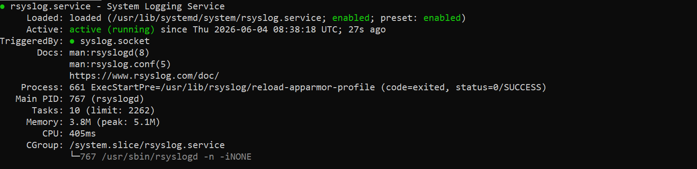
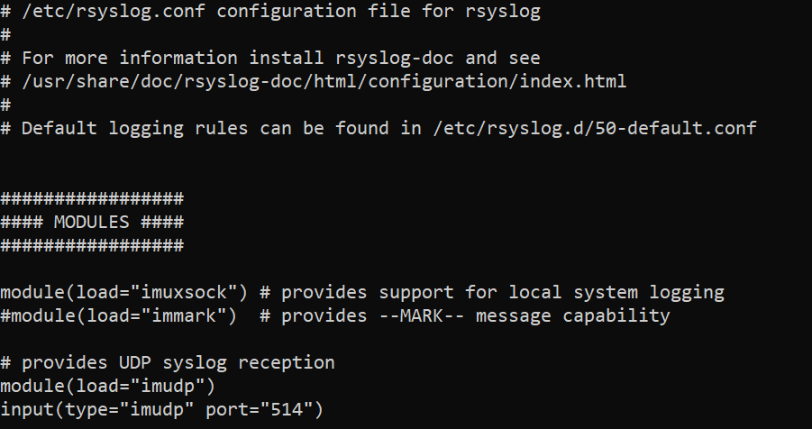
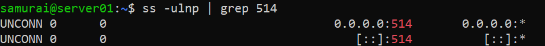
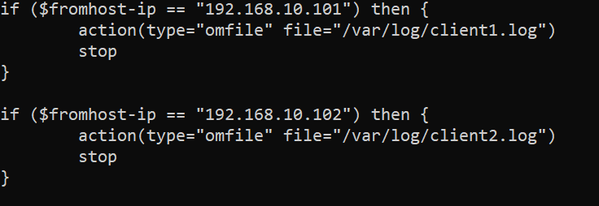
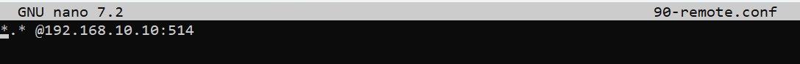
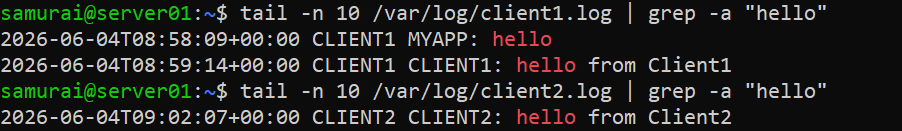

## Objective
Build a centralized logging environment where:
* SERVER receives logs from client1
* SERVER receives logs from client2
* Logs are stored in separate files:
	* /var/log/client1.log
	* /var/log/client2.log

---

## Network Layout

| Host | IP | 
|------|--------|
| server | 192.168.10.10 |
| client1 | 192.168.10.101 |
| client2 | 192.168.10.102 | 


## Environment
- OS: Ubuntu
- Tools: 

---

## Part 1 - Configure the rsyslog Server

### Verify rsyslog

```bash
sudo systemctl status rsyslog
```


### Enable UDP Syslog reception and restart the rsyslog service

```bash
sudo nano /etc/rsyslog.conf
sudo systemctl restart rsyslog
```



### Verify server is listening on port 514

```bash
ss -ulnp | grep 514
```



---

## Part 2 - Separate logs by Client

```bash
sudo nano /etc/rsyslog.d/30-multi-client.conf
sudo systemctl restart rsyslog
```



---

## Part 3 - Configure Client1 and Client2

```bash
sudo nano /etc/rsyslog.d/10-remote.conf
sudo systemctl restart rsyslog
```



---

## Part 4 - Test Log Delivery

from Client1:

```bash
logger -t CLIENT1 "hello from Client1"
```

from Client2:

```bash
logger -t CLIENT2 "hello from Client2"
```

from Server:

```bash
tail -n 10 /var/log/client1.log | grep -a "hello"
tail -n 10 /var/log/client1.log | grep -a "hello"
```




