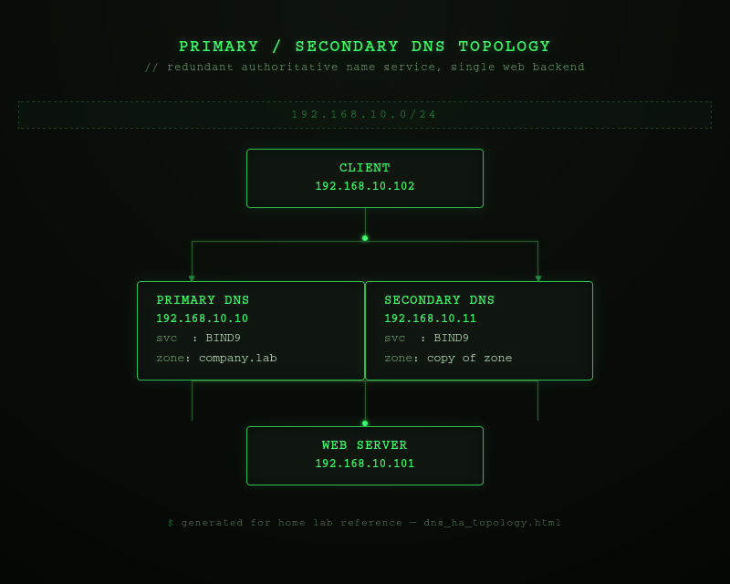
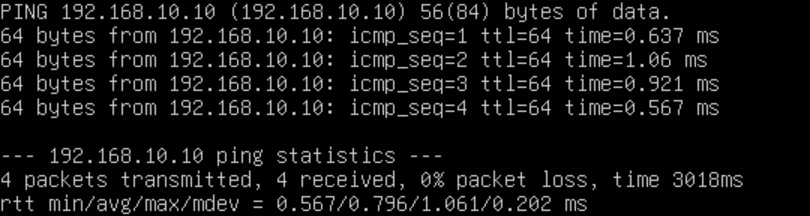
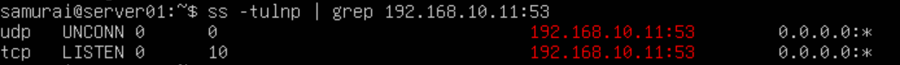
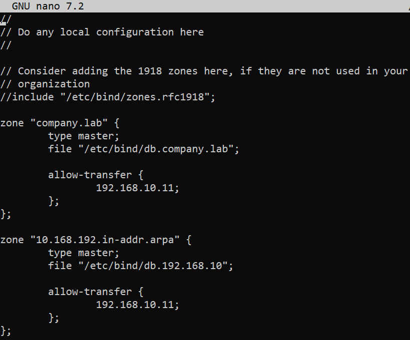
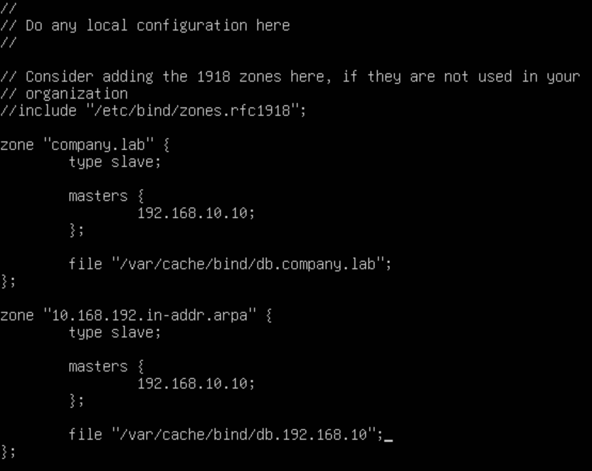
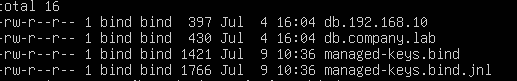

## Objective

Configure a Secondary DNS server that automatically replicates DNS zones from the Primary DNS server using zone transfers (AXFR).

---

## Environment
- Virtualization: VirtualBox
- OS: ( 1 Primary DNS Server VM + 1 Secondary DNS Server + 1 Web Server VM + 1 Client VM)

---

## Network Topology


---

## Prerequisites

This lab builds upon the following previous labs:

* Private DNS Infrastructure with BIND9
* Hosting Multiple Websites on One Server Using Nginx

The following components are assumed to already be configured:

* BIND9 is installed and running on the DNS server.
* The forward lookup zone company.lab has already been created.
* The forward zone file (/etc/bind/db.company.lab) contains the required DNS records.
* The client is configured to use the internal DNS server (192.168.10.10).
* DNS resolution between all virtual machines has been verified.
* The web server hosts multiple virtual websites using Nginx.

This lab extends the existing DNS infrastructure by adding a reverse lookup zone.

---

## Phase 1 - Prepare the Second DNS Server

### Step 1 - Install BIND9

```bash
sudo apt update
sudo apt install bind9 bind9-utils dnsutils
sudo systemctl status bind9
```


### Step 2 - Verify connectivity

```bash
ping 192.168.10.10
```


### Step 3 - Check the Port 53 is Listening

```bash
ss -tulnp | grep :53 
```


---

## Phase 2 - Configure the Primary DNS Server

### Step 1 - Modify the zone file on primary dns server

```bash
sudo nano /etc/bind/named.conf.local
```


### Step 2 - Verify the Configuration

```bash
sudo named-checkconf
sudo systemctl reload bind9
```
---

## Phase 3 - Configure the Secondary DNS Server

### Step 1 - Modify the zone file on secondary dns server

```bash
sudo nano /etc/bind/named.conf.local
```


### Step 2 - Verify the Configuration

```bash
sudo named-checkconf
sudo systemctl restart bind9
```

### Step 3 - Verify the Zone Files

```bash
ls -l /var/cache/bind/
```

