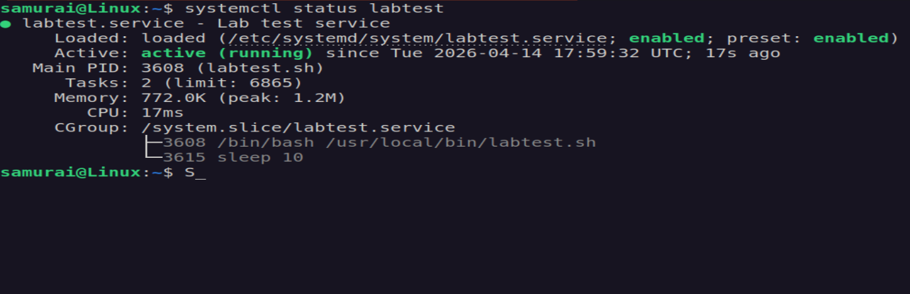
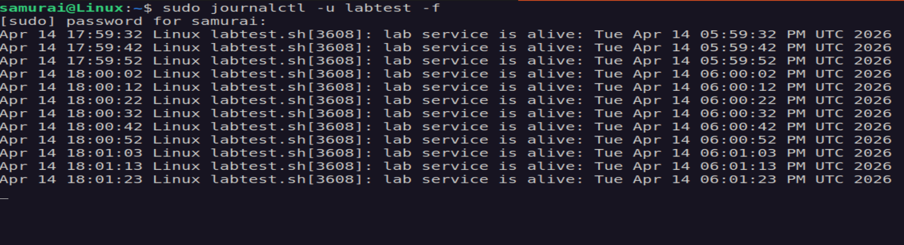
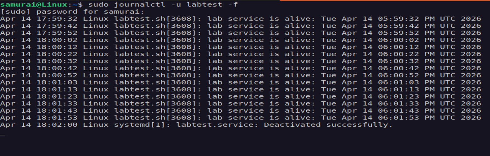
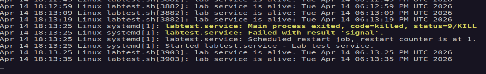
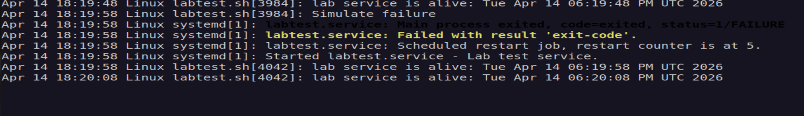

# 🧪 Systemd Service Restart Behavior Lab

## 📌 Objective
To test and understand how `systemd` handles automatic service restarts using the `Restart=on-failure` policy.

---

## ⚙️ Environment
- OS: Ubuntu (systemd-based)
- Tools: systemctl, journalctl, bash

---

## 🛠️ Setup

### 1. Create a test script

```bash
sudo nano /usr/local/bin/labtest.sh

#!/bin/bash
while true; do
	echo "lab service is alive: $(date)"
	sleep 10
done
```

Make it executable:
```bash
sudo chmod +x /usr/local/bin/labtest.sh
```
---

### 2. Create a system service
```bash
sudo nano /etc/systemd/system/labtest.service

[Unit]
Description=Lab test service
After=network.target

[Service]
ExecStart=/usr/local/bin/labtest.sh
Restart=on-failure
StandardOutput=journal

[Install]
WantedBy=multi-user.target
```
---

### Step 3 — Start the service
```bash
sudo systemctl daemon-reload
sudo systemctl enable labtest
sudo systemctl start labtest
systemctl status labtest
```


---

### Step 4 — Monitor Logs
```bash
sudo journalctl -u labtest -f
```


---

### 🧪 Experiment 1 - Killing the Service (SIGTERM)

```bash
sudo kill PID<labtest>
```

Expected Result:
The service should restart automatically

Actual Result:
The service did not restart



---

### 🔍 Investigation

The kill command sends SIGTERM (signal 15) by default.

Systemd treats SIGTERM as a graceful stop, meaning:
- the process exists normally
- exit status = 0 (SUCCESS)

Because of this, Restart=on-failure is not triggered.

---

### 🧪 Experiment 2 - Forcing a Failure (SIGKILL)

```bash
sudo kill -9 PID<labtest>
```

Result:
The service started automatically.



Explanation:
- kill -9 sends SIGKILL
- the process is terminated abruptly
- system detects this as a failure
- restart is triggered

---

### 🧪 Experiment 3 - Simulating Application Failure

Modify the script:

```bash
sudo nano /usr/local/bin/labtest.sh

#!/bin/bash
while true; do
	echo "lab service is alive: $(date)"
	sleep 10
	
	if [ $((RANDOM % 5)) -eq 0 ]; then
		echo "Simulated failure"
		exit 1
	fi
done
```

Restart the service: 

```bash
sudo systemctl restart labtest
```
Result: 
The service restarts automatically when it exits with an error.



---

## 📊 Summary

| Action | Signal | Result | Restart
|------|--------|------|------|
| kill | SIGTERM | Clean stop | No
| kill -9 | SIGKILL | Forced failure | Yes
| exit 1 | N/A | Application Error | Yes

---

## 🧠 Key Takeaways
- Restart=on-failure depends on exit status
- SIGTERM is treated as a normal stop
- SIGKILL is treated as a failure
- Proper testing requires simulating real failures


  
