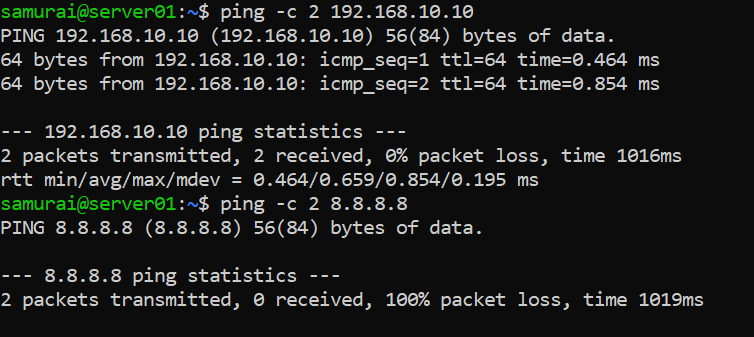
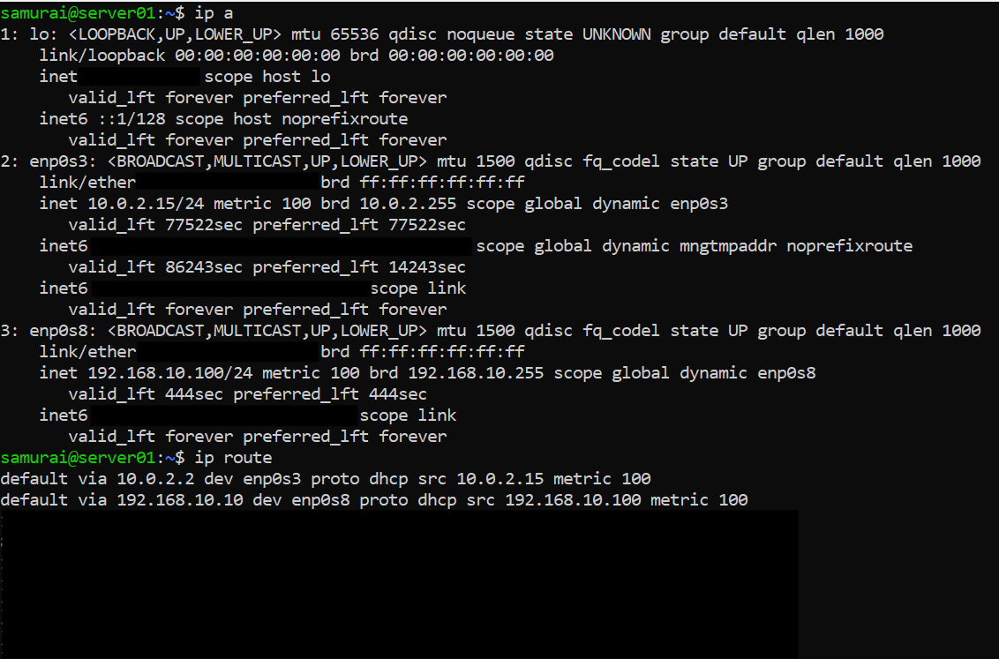
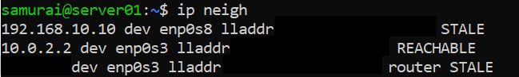
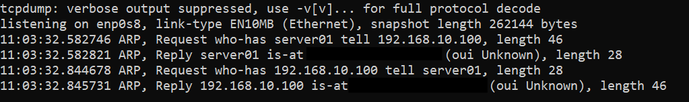
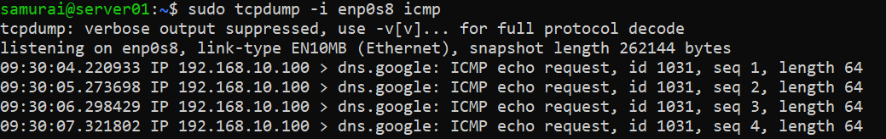
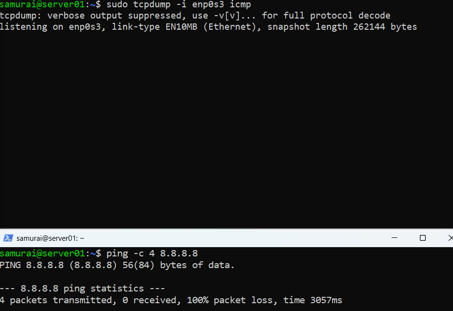
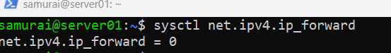
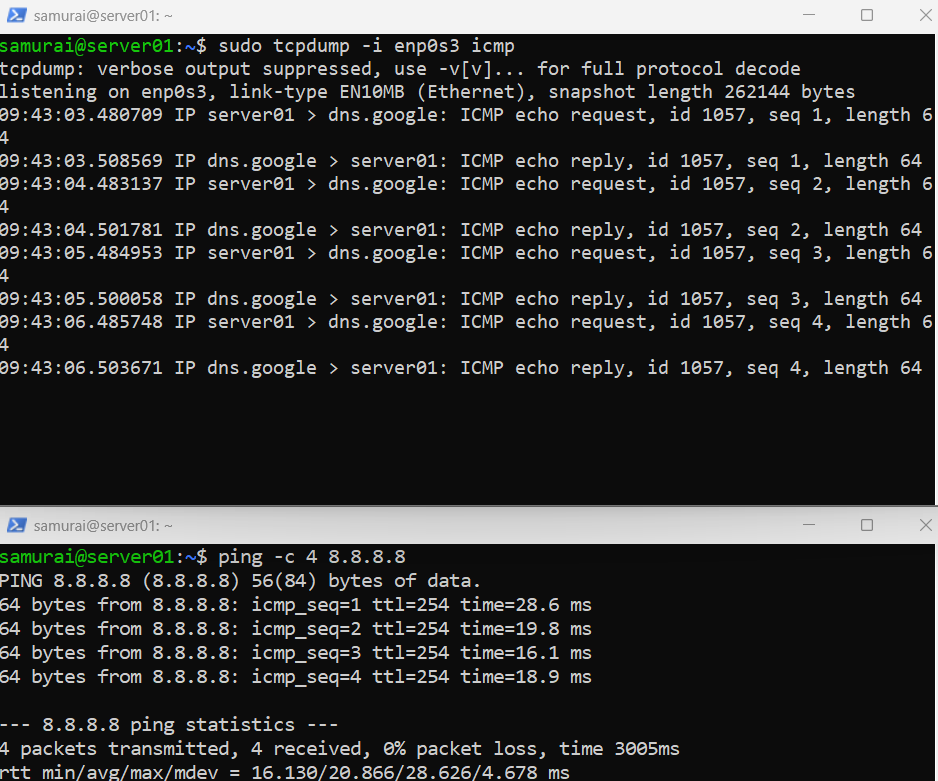

# 🧪 Inter-Interface Packet Forwarding Failure Investigation

## 📌 Objective
Diagnose why a client cannot reach the internet

---

## ⚙️ Environment
- Virtualization: VirtualBox
- OS: ( 1 DHCP Server VM + 1 Client VM)

---

## 🛠️ Lab Network Topology

**Server (DHCP)**
- IP: 192.168.10.10
- Interfaces:
   - enp0s8 -> LAN
   - enp0s3 -> NAT

**Client VM**
- IP: 192.168.10.100
- Interface: enp0s8
- Gateway: 192.168.10.10

---

## 🚨 Incident Statement

Client cannot access the internet

---

## 🔍 PHASE 1 — Verify the Problem

Run on Client VM:

```bash
ping -c 2 192.168.10.10
ping -c 2 8.8.8.8
```


Expected outcome:
- Gateway ping -> ✅ works
- Internet ping -> ❌ fails

**Conclusion:**
- Local network works -> L2 is OK
- Internet fails -> issue beyond local network

---

## PHASE 2 — Check Client Configuration

```bash
ip a
ip route
```


**Conclusion:**
- Client is correctly configured
- Traffic is sent to gateway

---

## PHASE 3 - Verify L2

### Step 1 - Check ARP

Run on client VM:

```bash
ip neigh
```


Expected outcome:
192.168.10.10 dev enp0s8 lladdr: XX:XX:XX:XX STALE

---

### Step 2 - Capture ARP

Run on client VM:

```bash
sudo tcpdump -i enp0s8 arp
ping 192.168.10.10
```


**Conclusion:**
- ARP works -> MAC resolution works
- L2 is fully functional

---

## Phase 4 - Follow the packet

### Step 1 - Capture incoming traffic

On server:

```bash
sudo tcpdump -i enp0s8 icmp
```
On client:

```bash
ping 8.8.8.8
```



Expected outcome:
- Packets arrive at server (enp0s8)

---

Step 2 - Check outgoing traffic

On server:

```bash
sudo tcpdump -i enp0s3 icmp
```


Expected outcome:
- No packets leaving

---

### 🧠 Key conclusion:
Server receives traffic but does not forward it. 

---

## Phase 5 - Identify root cause

Check on server:

```bash
sysctl net.ipv4.ip_forward
```



Root Cause:
- IP forwarding disabled
- Server is NOT acting as router

---

## ✅ Remediation

### Step 1 - Enable forwarding

```bash
sudo sysctl -w net.ipv4.ip_forward=1
```

### Step 2 - Add NAT

```bash
sudo iptables -t nat -A POSTROUTING -o enp0s3 -j MASQUERADE
```


---

### Step 3 - Testing

On client:

```bash
ping 8.8.8.8
```


---

## 🧠 FINAL ANALYSIS

| Layer | Status |
| L2 (MAC,ARP) | ✅ working |
| L3 (routing) | ❌ broken |
| Fix | Enable forwarding |


