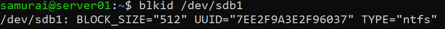
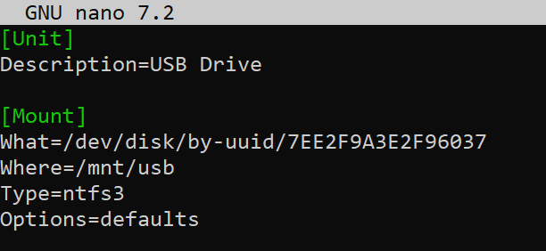
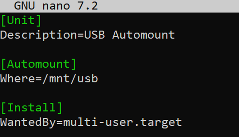
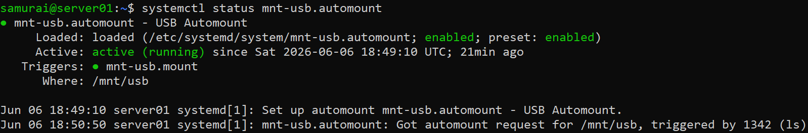
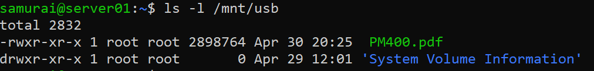
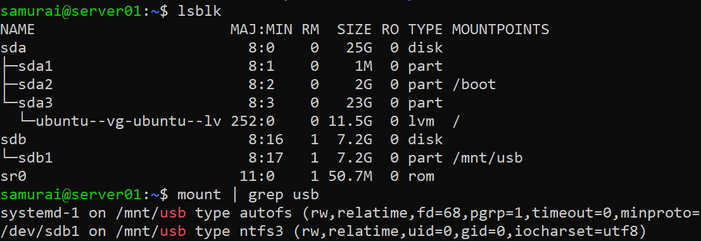

## Objective
Setting up automatic USB drive mounting on a Linux server using systemd mount and automount units

---

## Environment
- OS: Ubuntu
- Tools: system, USB drive

---

## Step 1 - Find Partition UUID

Prerequisite: Plugin USB drive

```bash
blkid /dev/sdb1
```



Note: UUID and filesystem type

## Step 2 - Create the Mount Unit

```bash
sudo nano /etc/systemd/system/mnt-usb.mount
```



## Step 3 - Create Automount Unit

```bash
sudo nano /etc/systemd/system/mnt-usb.automount
```



## Step 4 - Enable and Start

```bash
sudo systemctl enable mnt-usb.automount
sudo systemctl start mnt-usb.automount
```

## Step 5 - Verify and test

Check the automount is active:

```bash
systemctl status mnt-usb.automount
```



Trigger the mount by accessing the path:

```bash
ls -l /mnt/usb
```



Verify it's mounted:

```bash
lsblk 
mount | grep usb
```

